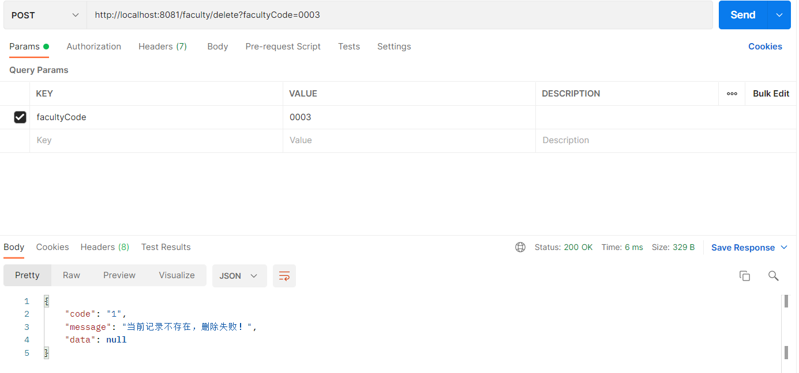
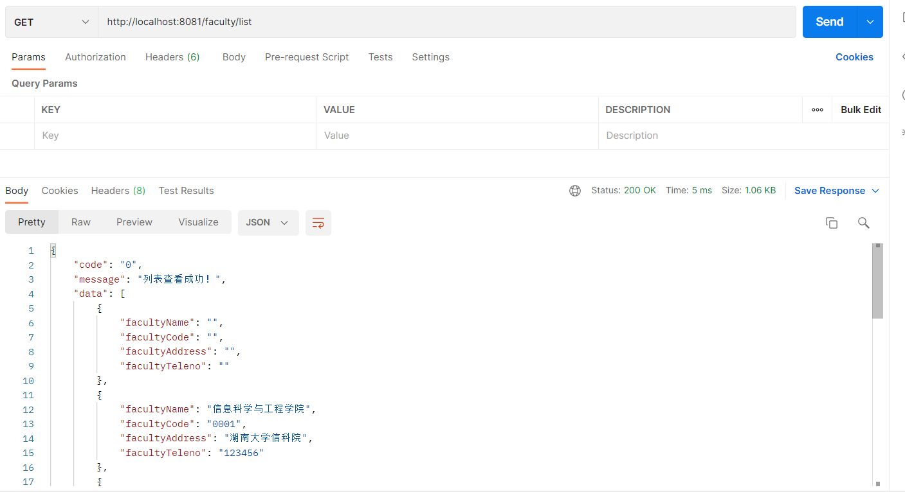

# DatabaseLab

## 一、简介

这是 2022 湖南大学 信息安全 数据库系统实验大作业。

## 二、需求

1. 假登录（没有身份认证模块）

2. 校建管理

   1. 学生管理

      > 姓名、学号、身份证号、宿舍、家庭地址、电话、出生日期、性别、年级、专业、主修院系、辅修院系、学位等级、已修学分。

      增加新学生、删除学生、修改学生信息、显示所有学生条目。

   2. 班级管理

      > 班级编号、 年级名称、所属专业

      查看班级所有学生···

   3. 专业管理

      > 专业名称，所属院系、学位等级、毕业学分。

      查看专业班级···

   4. 院系管理

      > 院系名称、代码、办公地点、电话。

      增加新院系、删除院系、修改院系信息、显示所有院系、查看指定院系专业

3. 教师管理

   1. 教师授课管理

      > 教师ID、（教师名称）、课程ID、（课程名称）

      增加新授课，删除授课条目、查看全部授课信息

   2. 录入教师管理

      > 教师编号、教师姓名、所属院系

      添加新教师、删除教师、修改教师信息、显示全部教师信息

4. 课程管理

   1. 课程信息管理

      > 课程编号、课程名称、课程说明、学时、学分、学位等级、开课院系

      增加新课程、删除课程、修改课程信息、查看全部课程信息

   2. 选修管理

      > 学号、（姓名）、课程ID（课程名）、成绩

      添加新条目、删除条目、修改条目、显示所有条目

   


## 三、前端接口

1. 校建管理

   1. 学生管理

      1. 查询学生

         **请求格式：**

         ```json
         { 
             "studentID": "xxxx",   // 学号
             "studentName": "xxxx", // 姓名
             "grade": "xxxx",       // 年级
             "major": "xxxx",       // 专业
             "degreelevel": "xxxx", // 学位等级
             "pageIndex": 1,        // 当前请求的页码
             "pageSize": 30         // 当前请求的页面条目数量
         }
         ```

         前五个条目为筛选条件，若某个筛选条件为空，则忽略该筛选条件，例如如果所有筛选条件为空，则获取所有用户。

         **返回格式：**

         ```json
         {
             "code": 0,    // 0 表示当前请求无问题
             "message": "OK", // 没问题时的回复
             /* 重要信息 */
             "response": {
                 "total": 302,   // 满足要求的条目个数，例如有302个条目
                 "pageIndex": 2, // 当前查询的页码（用于确认）
                 "tableData": [  // 存放表格条目信息的数组
                     {
                         "studentName" : "xxxx", // 学生姓名
                         "studentID": "xxxx",    // 学号
                         "identifier": "xxxx",   // 身份证号
                         "dormitory": "xxxx",    // 宿舍
                         "address": "xxxx",      // 家庭地址
                         "teleno": "xxxx",       // 电话
                         "birthday": "xxxx",     // 出生日期
                         "sex": "xxxx",          // 性别
                         "grade": "xxxx",        // 年级
                         "major": "xxxx",        // 专业
                         "majordepartment": "xxxx", // 主修院系
                         "minordepartment": "xxxx", // 辅修院系
                         "degreelevel": "xxxx",  // 学位等级
                         "credit": 23,          // 已修学分
                     },
                     ...
                 ]
             }
         }
         ```

         如果请求出错，则返回

         > 查询到空数据**不属于**错误。
         >
         > **注：在以下任何请求中，若请求出错则都沿用该返回格式。**

         ```json
         {
             "code": 1, // 1 表示出错
             "message": "<error message>" // 这里存放需要展示给用户看的错误信息
         }
         ```

      2. 删除学生

         **请求格式：**

         ```json
         {
             "studentID": "xxxx",   // 学号
         }
         ```

         **返回格式：**

         ```json
         {
             "code": 0,       // 0 表示当前请求无问题
             "message": "OK", // 没问题时的回复
             "response": null // 这里为空，因为没有需要返回的
         }
         ```

      3. 修改 & 增加学生信息（两个接口，沿用相同的请求格式）

         **请求格式：**

         ```json
         {
             "studentName" : "xxxx", // 学生姓名
             "studentID": "xxxx",    // 学号
             "identifier": "xxxx",   // 身份证号
             "dormitory": "xxxx",    // 宿舍
             "address": "xxxx",      // 家庭地址
             "teleno": "xxxx",       // 电话
             "birthday": "xxxx",     // 出生日期
             "sex": "xxxx",          // 性别
             "grade": "xxxx",        // 年级
             "major": "xxxx",        // 专业
             "majordepartment": "xxxx", // 主修院系
             "minordepartment": "xxxx", // 辅修院系
             "degreelevel": "xxxx",  // 学位等级
             /* 注，不可添加学生的已修学分，该学分应该由后端计算生成，而非人工填写 */
         }
         ```

         **返回格式：**

         ```json
         {
             "code": 0,       // 0 表示当前请求无问题
             "message": "OK", // 没问题时的回复
             "response": null // 这里为空，因为没有需要返回的
         }
         ```

## 四、后端接口实现

### 校建管理

#### 1.院系管理

##### 插入

post http://localhost:8081/faculty/insert


请求格式：

```json
{
    "facultyName": "环境工程学院",  		//not null
    "facultyCode": "0003",				//not null
    "facultyAddress": "湖南大学环境院",
    "facultyTeleno": "8801xxx"
}
```

返回格式：

```json
//成功
{
    "code": "0",
    "message": "成功",
    "data": {
        "facultyName": "环境工程学院",
        "facultyCode": "0003",
        "facultyAddress": "湖南大学环境院",
        "facultyTeleno": "8801xxx"
    }
}
//失败
{
    "code": "1",
    "message": "当前记录已存在，插入失败！",
    "data": null
}
```

##### 更新

post http://localhost:8081/faculty/update


请求格式：

```json
{
    "facultyName": "土木工程学院",			//not null
    "facultyCode": "0002",					//not null
    "facultyAddress": "湖南大学土木院x",	
    "facultyTeleno": "88010003"
}
```

返回格式：

```json
//成功
{
    "code": "0",
    "message": "成功",
    "data": {
        "facultyName": "土木工程学院",
        "facultyCode": "0002",
        "facultyAddress": "湖南大学土木院x",
        "facultyTeleno": "88010003"
    }
}
//失败
{
    "code": "1",
    "message": "当前记录不存在，无法更新！",
    "data": null
}
```

##### 删除

post http://localhost:8081/faculty/delete?facultyCode=0003



请求格式：

```json
{
    "params":{
        "facultyCode": "0003",
    }
}
```

返回格式：

```json
//成功
{
    "code": "0",
    "message": "成功",
    "data": null
}
//失败
{
    "code": "1",
    "message": "当前记录不存在，删除失败！",
    "data": null
}
```

##### 全部查询

get http://localhost:8081/faculty/list



返回格式：

```json
//成功
{
    "code": "0",
    "message": "列表查看成功！",
    "data": [
        {
            "facultyName": "信息科学与工程学院",
            "facultyCode": "0001",
            "facultyAddress": "湖南大学信科院",
            "facultyTeleno": "123456"
        },
        {
            "facultyName": "土木工程学院",
            "facultyCode": "0002",
            "facultyAddress": "湖南大学土木院x",
            "facultyTeleno": "88010003"
        },
        {
            "facultyName": "环境工程学院",
            "facultyCode": "00031",
            "facultyAddress": "",
            "facultyTeleno": "8801xxx"
        }
    ]
}
//列表为空时失败  
{
    "code": "1",
    "msg": "当前列表为空！",
    "data": null
}
```

##### 按name查询

get http://localhost:8081/faculty/query?facultyName=信息科学与工程学院


请求格式：

```json
{
    "params":{
        "facultyName": "信息科学与工程学院",
    }
}
```

返回格式：

```json
//成功
{
    "code": "0",
    "message": "查询成功",
    "data": [
        {
            "facultyName": "信息科学与工程学院",
            "facultyCode": "0001",
            "facultyAddress": "湖南大学信科院",
            "facultyTeleno": "123456"
        }
    ]
}
//失败
{
    "code": "1",
    "message": "查询失败，信息科学与工程学院1不存在",
    "data": null
}
```

