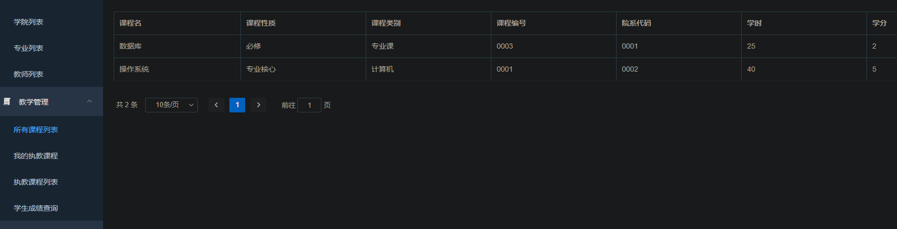

# 一、实验背景

教务管理工作是高等学校教育工作的一项重要内容，是整个学校管理的核心和基础。教务管理工作是指学校管理人员按照一定的教育方针，运用先进的管理手段，组织、协调、指挥与指导各方面人员的活动，以便高效率、高质量地完成各项教学任务，完成国家所制定的教育目标。教务管理工作是学校教学工作的中枢，是保证高校教学机制正常运转的枢纽，它是一项目的性、计划性、适应性、创造性和科学性很强的工作。教务管理工作关系到高校教学秩序的稳定和教学质量的提高，关系到高校的发展和人才的培养，教务管理在高校中占有相当重要的地位。
随着计算机技术的飞速发展和高等教育体制改革的不断深入，传统的教务管理方法、手段以及工作效率已不能适应新的发展需要，无法很好地完成教学管理工作。运用先进的信息技术，开发高校综合教务管理信息系统，并实现安全保护，保证数据安全和权限安全，是深化教务体制改革的有利措施。

# 二、实验目标

开发此教务管理系统软件，使教务人员及操作者进行教务管理，方便操作者随时添加、查询、修改，使工作人员从繁琐的填表，查表工作中解放出来；使供需双方都获得满意的结果；
该系统面向教务处、院、系教师和全校学生，目标在于实现如下功能：

- 基于角色的访问控制，
- 登陆认证
- 校建管理，包括院系管理、专业管理、班级管理
- 学生管理，包括学生信息的增删改查
- 教师管理，包括教师信息的增删改查，以及教师开课
- 选课管理，实现学生选课功能
- 成绩管理，实现教师给学生成绩，以及学生查看成绩等
- 实现管理员端、教师端、学生端权限分离

# 三、小组分工及实验流程

本次实验我们采用了spring boot来完成后端数据库管理系统的实现，使用前端vue框架来完成UI界面设计，使用SpringSecurity完成基于权限的访问控制。

本次实验具体分工如下：

- 吴宇涵：基于角色的访问控制、登陆认证、教师管理模块
- 翁子昂：数据库结构设计、校建管理模块和学生管理模块
- 孙睿江：学生选课模块和成绩管理模块、UI设计和实现

实验流程包括：

数据库结构设计、功能设计、后端系统实现、前端UI设计和实现、测试和修改、安全攻击测试。

# 四、数据库设计 

## 1.概念结构设计

首先我们powerdesigner中设计数据库的概念模型，针对我们要设计的教务管理系统的具体需求，构建了八个数据表

- 院系
- 专业
- 班级
- 学生
- 教师
- 课程
- 学生选课
- 课程班级

对于这些数据表之间的关系

存在如下关系：

学生————n_1————班级

班级————n_1————专业

专业————n_1————院系

教师————n_1————院系

教师————1_n————课程班级

课程————1_n————课程班级

学生————1_n————学生选课

学生选课————1_n————课程班级

根据上面的这些关系，我们可以构建出如下的概念结构模型：


## 2.逻辑结构设计

之后通过powerdesigner将设计好的概念结构模型转换成逻辑结构模型


## 3.物理结构设计

最后通过powerdesigner将逻辑结构模型生成物理结构模型，并生成相应的sql代码。

### 3.1 物理结构模型图


### 3.2 数据库建立SQL语句

根据物理结构模型，通过powerdesigner生成SQL语句，具体sql语句见所附源码文件夹。

同时额外增加了三个触发器，用于在学生选课表更新插入删除后实时修改学生表里的已修学分属性

该属性要求学生成绩大于60分才可以获得某一门课程的学分

# 五、数据库系统设计和实现

## 1.环境要求

集成开发工具：IDEA Pro

数据库管理系统：MySQL 8.0

语言：java 8

接口测试工具：postman

## 2.项目整体架构

数据库后端项目基于**Spring boot**，整体分为三层。

- 数据持久层

  目的是在java对象与数据库之间建立映射，也就是说它的作用是将某一个Java类对应到数据库中的一张表。在我们的项目中，就将创建一个实体类User映射到数据库的user表，表中的每个字段对应于实体类的每个属性。

  - domain：存放实体类的包，比如User类，其作为对应数据库user表的一个实体类。

  - repository: 存放一些数据访问类（也就是一些能操纵数据库的类）的包，比如存放能对user表进行增删改查的类，这一层也仅仅就是基础的增删改查，不附带额外的业务逻辑。

- 业务逻辑层

  作用是处理业务逻辑。比如在本项目中，我们就在业务逻辑层实现具体插入删除的逻辑，像是插入person要连带着插入user等逻辑都写在这里。

  - service: 存放业务逻辑接口的包。
  - serviceImpl: 存放业务逻辑实现类的包，其中的类实现service中的接口。

- 控制层

  作用是接收视图层的请求并调用业务逻辑层的方法。比如视图层请求插入用户并发来了用户的信息，那么控制层就调用业务逻辑层的登录方法，并将用户信息作为参数传入，在将结果返回给视图层。

  - controller: 存放控制器的包。比如UserController

**同时包括额外的包：**

- security包

  基于Spring Security+JWT，提供用户登录，用户认证，和基于角色的权限控制等功能。

- config包

  提供了跨域配置、安全配置等。

- utils包

  提供了统一输出结构的工具类等。

。

可以发现这样一个架构就是自底向上的，所以下面我们按照自底向上来创建项目。

### 2.1 数据持久层

**实体**

构建与数据表对应的数据实体

 

**dao**

实现各个数据表基本的增删改查操作

 

### 2.2 业务逻辑层

通过调用dao层基本的增删改查操作实现每一个模块具体的业务逻辑

 

### 2.3 控制层

调用业务逻辑层的实现，实现后端接口，将接口暴露给前端

 

### 2.4 security

实现用户登录验证，基于角色的权限控制等功能

 

#### 2.4.1 Spring Security

Spring Security 是一个专注于为 Java 应用程序提供身份验证和授权的框架。与所有 Spring 项目一样，Spring Security 的真正强大之处在于它可以轻松扩展以满足自定义需求。

**特性：**

- 支持对身份认证和访问鉴权的自定义扩展
- 防止会话固定、点击劫持、跨站点请求伪造等攻击
- Servlet API 集成
- 与 Spring Web MVC 的可选集成

从官方的介绍来说，Spring Security的核心是提供认证（Authentication）、授权（Authorization）和攻击防护。

#### 2.4.2 JWT

**利用token进行用户身份验证的流程：**

- 客户端使用用户名和密码请求登录

- 服务端收到请求，验证用户名和密码

- 验证成功后，服务端会签发一个token，再把这个token返回给客户端

- 客户端收到token后可以把它存储起来，比如放到cookie中

- 客户端每次向服务端请求资源时需要携带服务端签发的token，可以在cookie或者header中携带

- 服务端收到请求，然后去验证客户端请求里面带着的token，如果验证成功，就向客户端返回请求数据

这种基于token的认证方式相比传统的session认证方式更节约服务器资源，并且对移动端和分布式更加友好。其优点如下：

- 支持跨域访问：cookie是无法跨域的，而token由于没有用到cookie(前提是将token放到请求头中)，所以跨域后不会存在信息丢失问题
- 无状态：token机制在服务端不需要存储session信息，因为token自身包含了所有登录用户的信息，所以可以减轻服务端压力
- 更适用CDN：可以通过内容分发网络请求服务端的所有资料
- 更适用于移动端：当客户端是非浏览器平台时，cookie是不被支持的，此时采用token认证方式会简单很多
- 无需考虑CSRF：由于不再依赖cookie，所以采用token认证方式不会发生CSRF，所以也就无需考虑CSRF的防御

而JWT就是上述流程当中token的一种具体实现方式，其全称是JSON Web Token。

通俗地说，JWT的本质就是一个字符串，它是将用户信息保存到一个Json字符串中，然后进行编码后得到一个JWT token，并且这个JWT token带有签名信息，接收后可以校验是否被篡改，所以可以用于在各方之间安全地将信息作为Json对象传输。

JWT的认证流程如下：

- 首先，前端通过Web表单将自己的用户名和密码发送到后端的接口，这个过程一般是一个POST请求。建议的方式是通过SSL加密的传输(HTTPS)，从而避免敏感信息被嗅探
- 后端核对用户名和密码成功后，将包含用户信息的数据作为JWT的Payload，将其与JWT Header分别进行Base64编码拼接后签名，形成一个JWT Token，形成的JWT Token就是一个如同lll.zzz.xxx的字符串
- 后端将JWT Token字符串作为登录成功的结果返回给前端。前端可以将返回的结果保存在浏览器中，退出登录时删除保存的JWT Token即可
- 前端在每次请求时将JWT Token放入HTTP请求头中的Authorization属性中（可用于解决XSS和XSRF问题）
- 后端检查前端传过来的JWT Token，验证其有效性，比如检查签名是否正确、是否过期、token的接收方是否是自己等等
- 验证通过后，后端解析出JWT Token中包含的用户信息，进行其他逻辑操作(一般是根据用户信息得到权限等)，返回结果


#### 2.4.3 RBAC模型

我们使用RBAC（Role-Based Access Control，基于角色的访问控制）模型设计用户，角色和权限间的关系。

在这种模型中，用户与角色之间，角色与权限之间，是多对多的关系。

|   数据表名    |     中文表名     | 备注说明 |
| :-----------: | :--------------: | :------: |
|   sys_user    |    系统用户表    |  基础表  |
|   sys_menu    |      权限表      |  基础表  |
|   sys_role    |      角色表      |  基础表  |
| sys_role_menu | 角色与权限关系表 |  中间表  |
| sys_user_role | 用户与角色关系表 |  中间表  |

基于RBAC配置数据库的sql语句见`powerdesigner\1.sql`，我们建立3个角色：管理员、学生、教师。

## 3.实现的关键类及注释

### 3.1 登录认证与基于角色的权限控制

#### 3.1.1 认证与权限基础类

##### JWT工具类

实现登录成功后token的生成

```java
/**
 * JWT工具类
 */
@Slf4j
public class JWTTokenUtil {

    /**
     * 私有化构造器
     */
    private JWTTokenUtil(){}

    /**
     * 生成Token
     */
    public static String createAccessToken(SelfUserEntity selfUserEntity){
        // 登陆成功生成JWT
        String token = Jwts.builder()
                // 放入用户名和用户ID
                .setId(selfUserEntity.getUserId()+"")
                // 主题
                .setSubject(selfUserEntity.getUsername())
                // 签发时间
                .setIssuedAt(new Date())
                // 签发者
                .setIssuer("HNU")
                // 自定义属性 放入用户拥有权限
                .claim("authorities", JSON.toJSONString(selfUserEntity.getAuthorities()))
                // 失效时间
                .setExpiration(new Date(System.currentTimeMillis() + JWTConfig.expiration))
                // 签名算法和密钥
                .signWith(SignatureAlgorithm.HS512, JWTConfig.secret)
                .compact();
        return token;
    }
}
```

##### 登录成功处理类等

```java
@Slf4j
@Component
public class UserLoginSuccessHandler implements AuthenticationSuccessHandler {
    /**
     * 登录成功返回结果
     */
    @Override
    public void onAuthenticationSuccess(HttpServletRequest request, HttpServletResponse response, Authentication authentication) throws IOException {
        // 组装JWT
        SelfUserEntity selfUserEntity =  (SelfUserEntity) authentication.getPrincipal();
        String token = JWTTokenUtil.createAccessToken(selfUserEntity);
        token = JWTConfig.tokenPrefix + token;
        // 封装返回参数
        Map<String,Object> resultData = new HashMap<>();
        resultData.put("code","200");
        resultData.put("message", "登录成功");
        Map<String, Object> data = new HashMap<>();
        data.put("token",token);
        data.put("role", SecurityUtil.getUserRole());
        resultData.put("data",data);
        Result.responseJson(response,resultData);
    }
}
```

类似地，还有：**登出成功处理类、暂无权限处理类、用户未登录处理类、登录失败处理类**

#### 3.1.2 SpringSecurity核心配置类

完成以下配置：

- 配置登录验证逻辑

- 不进行权限验证的请求或资源
- 未登录自定义处理类、登录成功自定义处理类、登录失败自定义处理类、用户登出自定义处理类、没有权限自定义处理类
- 配置登入地址、登出地址
- 因为是基于Token的，取消跨站请求伪造和session
- 添加JWT过滤器

```java
/**
 * SpringSecurity配置类
 */
@Configuration
@EnableWebSecurity
@EnableGlobalMethodSecurity(prePostEnabled = true) //开启权限注解,默认是关闭的
public class SecurityConfig extends WebSecurityConfigurerAdapter {
    /**
     * 自定义登录成功处理器
     */
    @Autowired
    private UserLoginSuccessHandler userLoginSuccessHandler;
    /**
     * 自定义登录失败处理器
     */
    @Autowired
    private UserLoginFailureHandler userLoginFailureHandler;
    /**
     * 自定义注销成功处理器
     */
    @Autowired
    private UserLogoutSuccessHandler userLogoutSuccessHandler;
    /**
     * 自定义暂无权限处理器
     */
    @Autowired
    private UserAuthAccessDeniedHandler userAuthAccessDeniedHandler;
    /**
     * 自定义未登录的处理器
     */
    @Autowired
    private UserAuthenticationEntryPointHandler userAuthenticationEntryPointHandler;
    /**
     * 自定义登录逻辑验证器
     */
    @Autowired
    private UserAuthenticationProvider userAuthenticationProvider;

    /**
     * 加密方式
     */
    @Bean
    public BCryptPasswordEncoder bCryptPasswordEncoder(){
        return new BCryptPasswordEncoder();
    }
    /**
     * 注入自定义PermissionEvaluator
     */
    @Bean
    public DefaultWebSecurityExpressionHandler userSecurityExpressionHandler(){
        DefaultWebSecurityExpressionHandler handler = new DefaultWebSecurityExpressionHandler();
        handler.setPermissionEvaluator(new UserPermissionEvaluator());
        return handler;
    }

    /**
     * 配置登录验证逻辑
     */
    @Override
    protected void configure(AuthenticationManagerBuilder auth){
        //这里可启用我们自己的登陆验证逻辑
        auth.authenticationProvider(userAuthenticationProvider);
    }
    /**
     * 配置security的控制逻辑
     */
    @Override
    protected void configure(HttpSecurity http) throws Exception {
        http.authorizeRequests()
                // 不进行权限验证的请求或资源(从配置文件中读取)
               .antMatchers(JWTConfig.antMatchers.split(",")).permitAll()
                // 其他的需要登陆后才能访问
                .anyRequest().authenticated()
                .and()
                // 配置未登录自定义处理类
                .httpBasic().authenticationEntryPoint(userAuthenticationEntryPointHandler)
                .and()
                // 配置登录地址
                .formLogin()
                .loginProcessingUrl("/user/login")
                //若未登录，则向前端返回401
                .loginPage("/user/loginRequire")
                // 配置登录成功自定义处理类
                .successHandler(userLoginSuccessHandler)
                // 配置登录失败自定义处理类
                .failureHandler(userLoginFailureHandler)
                .and()
                // 配置登出地址
                .logout()
                .logoutUrl("/user/logout")
                // 配置用户登出自定义处理类
                .logoutSuccessHandler(userLogoutSuccessHandler)
                .and()
                // 配置没有权限自定义处理类
                .exceptionHandling().accessDeniedHandler(userAuthAccessDeniedHandler)
                .and()
                // 开启跨域
                .cors()
                .and()
                // 取消跨站请求伪造防护
                .csrf().disable();
        // 基于Token不需要session
        http.sessionManagement().sessionCreationPolicy(SessionCreationPolicy.STATELESS);
        // 禁用缓存
        http.headers().cacheControl();
        // 添加JWT过滤器
        http.addFilter(new JWTAuthenticationTokenFilter(authenticationManager()));
    }
}
```

#### 3.1.3 JWT拦截类

请求接口时会进入这里验证Token是否合法和过期

```java
/**
 * JWT接口请求校验拦截器
 */
@Slf4j
public class JWTAuthenticationTokenFilter extends BasicAuthenticationFilter {

    public JWTAuthenticationTokenFilter(AuthenticationManager authenticationManager) {
        super(authenticationManager);
    }

    @Override
    protected void doFilterInternal(HttpServletRequest request, HttpServletResponse response, FilterChain filterChain) throws ServletException, IOException {
        // 获取请求头中JWT的Token
        String tokenHeader = request.getHeader(JWTConfig.tokenHeader);
        if (null!=tokenHeader && tokenHeader.startsWith(JWTConfig.tokenPrefix)) {
            try {
                // 截取JWT前缀
                String token = tokenHeader.replace(JWTConfig.tokenPrefix, "");
                // 解析JWT
                Claims claims = Jwts.parser()
                        .setSigningKey(JWTConfig.secret)
                        .parseClaimsJws(token)
                        .getBody();
                // 获取用户名
                String username = claims.getSubject();
                String userId=claims.getId();
                if(!StringUtils.isEmpty(username)&&!StringUtils.isEmpty(userId)) {
                    // 获取角色
                    List<GrantedAuthority> authorities = new ArrayList<>();
                    String authority = claims.get("authorities").toString();
                    if(!StringUtils.isEmpty(authority)){
                        List<Map<String,String>> authorityMap = JSONObject.parseObject(authority, List.class);
                        for(Map<String,String> role : authorityMap){
                            if(!StringUtils.isEmpty(role)) {
                                authorities.add(new SimpleGrantedAuthority(role.get("authority")));
                            }
                        }
                    }
                    //组装参数
                    SelfUserEntity selfUserEntity = new SelfUserEntity();
                    selfUserEntity.setUsername(claims.getSubject());
                    selfUserEntity.setUserId(Long.parseLong(claims.getId()));
                    selfUserEntity.setAuthorities(authorities);
                    UsernamePasswordAuthenticationToken authentication = new UsernamePasswordAuthenticationToken(selfUserEntity, userId, authorities);
                    SecurityContextHolder.getContext().setAuthentication(authentication);
                }
            } catch (ExpiredJwtException e){
                log.info("Token过期");
                response.setStatus(401);
            } catch (Exception e) {
                log.info("Token无效");
                response.setStatus(401);
            }
        }
        filterChain.doFilter(request, response);
        return;
    }
}
```

#### 3.1.4 自定义登录验证类

获取表单输入中的用户名和密码，判断用户名是否存在、密码是否正确，再查询用户角色进行登录

```java
@Component
public class UserAuthenticationProvider implements AuthenticationProvider {
    @Autowired
    private SelfUserDetailsService selfUserDetailsService;
    @Autowired
    private SysUserService sysUserService;

    @Override
    public Authentication authenticate(Authentication authentication) throws AuthenticationException {
        // 获取表单输入中返回的用户名
        String userName = (String) authentication.getPrincipal();
        // 获取表单中输入的密码
        String password = (String) authentication.getCredentials();
        // 查询用户是否存在
        SelfUserEntity userInfo = selfUserDetailsService.loadUserByUsername(userName);
        if (userInfo == null) {
            throw new UsernameNotFoundException("用户名不存在");
        }
        // 我们还要判断密码是否正确，这里我们的密码使用BCryptPasswordEncoder进行加密的
        if (!new BCryptPasswordEncoder().matches(password, userInfo.getPassword())) {
            throw new BadCredentialsException("密码不正确");
        }
        // 还可以加一些其他信息的判断，比如用户账号已停用等判断
        if (userInfo.getStatus().equals("PROHIBIT")){
            throw new LockedException("该用户已被冻结");
        }
        // 角色集合
        Set<GrantedAuthority> authorities = new HashSet<>();
        // 查询用户角色
        List<SysRoleEntity> sysRoleEntityList = sysUserService.selectSysRoleByUserId(userInfo.getUserId());
        for (SysRoleEntity sysRoleEntity: sysRoleEntityList){
            authorities.add(new SimpleGrantedAuthority("ROLE_"+sysRoleEntity.getRoleName()));
        }
        userInfo.setAuthorities(authorities);
        // 进行登录
        return new UsernamePasswordAuthenticationToken(userInfo, password, authorities);
    }
    @Override
    public boolean supports(Class<?> authentication) {
        return true;
    }
}
```

#### 3.1.5 自定义权限注解验证类

基于SpringSecurity，我们在定义后端的URL访问方法时，使用**@PreAuthorize**注解，定义所需的访问权限权限。如果对应的表达式返回结果为**true**则表示拥有对应的权限,反之则没有权限,会进入到我们配置的**UserAuthAccessDeniedHandler**(暂无权限处理类)中进行处理。

权限的验证可以通过自定义注解， 使**hasPermisson()**注解将当前用户拥有的权限和角色_权限表对比，实现鉴权。

```java
@Component
public class UserAuthenticationProvider implements AuthenticationProvider {
    @Autowired
    private SelfUserDetailsService selfUserDetailsService;
    @Autowired
    private SysUserService sysUserService;

    @Override
    public Authentication authenticate(Authentication authentication) throws AuthenticationException {
        // 获取表单输入中返回的用户名
        String userName = (String) authentication.getPrincipal();
        // 获取表单中输入的密码
        String password = (String) authentication.getCredentials();
        // 查询用户是否存在
        SelfUserEntity userInfo = selfUserDetailsService.loadUserByUsername(userName);
        if (userInfo == null) {
            throw new UsernameNotFoundException("用户名不存在");
        }
        // 我们还要判断密码是否正确，这里我们的密码使用BCryptPasswordEncoder进行加密的
        if (!new BCryptPasswordEncoder().matches(password, userInfo.getPassword())) {
            throw new BadCredentialsException("密码不正确");
        }
        // 还可以加一些其他信息的判断，比如用户账号已停用等判断
        if (userInfo.getStatus().equals("PROHIBIT")){
            throw new LockedException("该用户已被冻结");
        }
        // 角色集合
        Set<GrantedAuthority> authorities = new HashSet<>();
        // 查询用户角色
        List<SysRoleEntity> sysRoleEntityList = sysUserService.selectSysRoleByUserId(userInfo.getUserId());
        for (SysRoleEntity sysRoleEntity: sysRoleEntityList){
            authorities.add(new SimpleGrantedAuthority("ROLE_"+sysRoleEntity.getRoleName()));
        }
        userInfo.setAuthorities(authorities);
        // 进行登录
        return new UsernamePasswordAuthenticationToken(userInfo, password, authorities);
    }
    @Override
    public boolean supports(Class<?> authentication) {
        return true;
    }
}
```

#### 3.1.8 认证与权限相关的实现

基本的增删改查在**mapper**中实现。

登录和登出的接口已在**SpringSecurity**中配置。

##### 管理员 AdminImpl

注册管理员

```java
   /**
     * 注册管理员
     *
     * @return 0:成功, 1:失败，邀请码无效
     */
    @Override
    public int adminRegister(String username, String password, String code) {
        if (sysUserDao.selectSysUserByUsername(username).size() > 0) {
            return 2;
        }
        //验证邀请码
        if (!Objects.equals(code, "hnu123456"))
            return 1;
        // 注册用户
        SysUserEntity sysUserEntity = new SysUserEntity();
        sysUserEntity.setUsername(username);
        sysUserEntity.setPassword(bCryptPasswordEncoder.encode(password));
        // 设置用户状态
        sysUserEntity.setStatus("NORMAL");
        sysUserService.save(sysUserEntity);
        // 分配角色
        SysUserRoleEntity sysUserRoleEntity = new SysUserRoleEntity();
        sysUserRoleEntity.setRoleId(1L);
        sysUserRoleEntity.setUserId(sysUserEntity.getUserId());
        sysUserRoleService.save(sysUserRoleEntity);
        return 0;
    }
```

注册学生用户

```java
/**
 * 注册学生用户
 *
 * @return 0:成功, 1:失败，该用户名已存在
 */
@Override
public int studentRegister(String username, String password) {
    // 注册用户
    SysUserEntity sysUserEntity = new SysUserEntity();
    sysUserEntity.setUsername(username);
    sysUserEntity.setPassword(bCryptPasswordEncoder.encode(password));
    // 设置用户状态
    sysUserEntity.setStatus("NORMAL");
    int num = sysUserDao.selectSysUserByUsername(username).size();
    if (num > 0)
        return 1;
    sysUserService.save(sysUserEntity);
    SysUserRoleEntity sysUserRoleEntity = new SysUserRoleEntity();
    sysUserRoleEntity.setRoleId(2L);
    sysUserRoleEntity.setUserId(sysUserEntity.getUserId());
    sysUserRoleService.save(sysUserRoleEntity);
    return 0;
}
```

注册教师用户

```java
/**
 * 注册教师用户
 *
 * @return 0:成功, 1:失败，该用户名已存在
 */
@Override
public int teacherRegister(String username, String password) {
    // 注册用户
    SysUserEntity sysUserEntity = new SysUserEntity();
    sysUserEntity.setUsername(username);
    sysUserEntity.setPassword(bCryptPasswordEncoder.encode(password));
    // 设置用户状态
    sysUserEntity.setStatus("NORMAL");
    int num = sysUserDao.selectSysUserByUsername(username).size();
    if (num > 0)
        return 1;
    sysUserService.save(sysUserEntity);
    SysUserRoleEntity sysUserRoleEntity = new SysUserRoleEntity();
    sysUserRoleEntity.setRoleId(3L);
    sysUserRoleEntity.setUserId(sysUserEntity.getUserId());
    sysUserRoleService.save(sysUserRoleEntity);
    return 0;
}
```

注册普通用户

```java
/**
 * 注册普通用户
 *
 * @return 0:成功, 1:失败，该学生不存在, 2:失败，该教师不存在，3:失败，该用户名已存在, 4:失败，没有该角色
 */
@Override
public int userRegister(String username, String password, String role) {
    int num = sysUserDao.selectSysUserByUsername(username).size();
    if (num > 0)
        return 3;
    //查看角色
    if (Objects.equals(role, "STUDENT")) {
        int num2 = studentDao.getByID(username).size();
        if (num2 == 0)
            return 1;
        studentRegister(username, password);
        return 0;
    } else if (Objects.equals(role, "TEACHER")) {
        int num3 = teacherDao.getByID(username).size();
        if (num3 == 0)
            return 2;
        teacherRegister(username, password);
        return 0;
    }
    return 4;
}
```

查找用户名-角色名

```java
/**
 * 根据用户名查找用户名-角色名
 * 若用户名为空，则查看全部
 */
@Override
public Map<Object, Object> selectSysUserRoleByUsername(Map<Object, Object> map, int pageIndex, int pageSize) {

    StringBuilder sql = new StringBuilder("SELECT sys_user.username,sys_role.role_name FROM sys_user,sys_role,sys_user_role  WHERE sys_user.user_id=sys_user_role.user_id and sys_role.role_id=sys_user_role.role_id ");
    //给出params
    List<Object> params = new ArrayList<>();
    if (map.get("username") != null) {
        String s = map.get("username").toString();
        if (s != null && !s.trim().isEmpty()) {
            sql.append(" and username = ?");
            params.add(s);
        }
    }
    sql.append(" ORDER BY username");
    //统计个数
    String sql2 = "SELECT count(*) as sum from (" + sql + ") as a;";
    int count = jdbcTemplate.queryForObject(sql2, Integer.class, params.toArray());
    //添加页数条目限制
    sql.append(" limit ?,?");
    params.add((pageIndex - 1) * pageSize);
    params.add(pageSize);

    Map<Object, Object> response = new HashMap<>();
    response.put("total", count);
    response.put("pageIndex", pageIndex);
    response.put("tableData", jdbcTemplate.queryForList(sql.toString(), params.toArray()));
    return response;
}
```

授予教师管理员角色

```java
/**
 * 授予教师管理员角色
 *
 * @param : map(username,roleName,superCode)
 * @return: 0:成功，1:该用户已经有该角色，无法授予，2:授予的权限为“ADMIN”时,超级权限码不正确，3:无法授予非管理员角色，4:无法授予学生和管理员额外的角色
 */
@Override
public int insertRoleByUsername(Map<Object, Object> map) {
    String roleName = map.get("roleName").toString();
    Long userId = sysUserDao.selectUserIdByUserName(map.get("username").toString());
    Long roleId = sysRoleDao.selectRoleIdByRoleName(map.get("roleName").toString());
    List<Map<String, Object>> list = (List<Map<String, Object>>) selectSysUserRoleByUsername(map, 1, 3).get("tableData");
    for (Map<String, Object> stringObjectMap : list) {
        String roleName1 = stringObjectMap.get("role_name").toString();
        if (Objects.equals(roleName, roleName1)) {
            return 1;
        } else if (Objects.equals(roleName1, "ADMIN") || Objects.equals(roleName1, "STUDENT")) {
            return 4;
        }
    }
    if (Objects.equals(roleName, "ADMIN")) {
        if (map.get("superCode") == null)
            return 2;
        String superCode = map.get("superCode").toString();
        if (!Objects.equals(superCode, "hnu123456")) {
            return 2;
        }
    }
    if (!Objects.equals(roleName, "ADMIN")) {
        return 3;
    }
    Map<String, Long> mapId = new HashMap<>();
    mapId.put("userId", userId);
    mapId.put("roleId", roleId);
    sysUserRoleDao.myInsert(mapId);
    return 0;
}
```
##### 普通用户 UserImpl

```java
@Service
public class UserServiceImpl implements UserService {
    BCryptPasswordEncoder bCryptPasswordEncoder = new BCryptPasswordEncoder();

    @Resource
    private SysUserDao sysUserDao;

    @Resource
    private SelfUserDetailsService selfUserDetailsService;

    /**
     * 当前用户修改密码
     * @return 0:成功, 1:失败，原密码错误
     */
    @Override
    public int changePassword(Map<String, String> map)
    {
        String oldPassword=map.get("oldPassword");
        String newPassword=map.get("newPassword");
        String userName=getUserName();
        SelfUserEntity userInfo = selfUserDetailsService.loadUserByUsername(userName);
        if (!bCryptPasswordEncoder.matches(oldPassword, userInfo.getPassword())) {
            return 1;
        }
        else
        {
            Map<String, Object> map2 = new HashMap<>();
            map2.put("username",userName);
            map2.put("password",bCryptPasswordEncoder.encode(newPassword));
            sysUserDao.updatePasswordByUsername(map2);
            return 0;
        }
    }
```

### 3.2 校建、学生、教师管理

下面以学生管理为例，展示一下核心代码，其余院系、专业、班级、教师、课程、教师开课、学生选课模块的核心代码原理都类似。

##### 插入

dao层实现基于基本sql语句的插入功能

```java
    /**
     * 插入
     * @param student student实体
     * @return student实体
     */
    public Student insert(Student student) {
        String sql="insert into student values (?,?,?,?,?,?,?,?,?,?,?)";
        jdbcTemplate.update(sql,
                student.getStudentName(),
                student.getStudentID(),
                student.getClassCode(),
                student.getIdentifier(),
                student.getDormitory(),
                student.getAddress(),
                student.getTeleno(),
                student.getBirthday(),
                student.getSex(),
                student.getGrade(),
                student.getCompletedCredits());
        return student;
    }
```

impl层实现业务逻辑，增加只有当前学生不存在时才可以插入的判断

```java
 /**
     * 插入
     * @param student 学生实体
     * @return 执行结果
     */
    @Override
    public int insert(Student student) {
        int num=studentDao.getByID(student.getStudentID()).size();
        System.out.println(student.getStudentID());
        System.out.println(student.getClassCode());
        int classNum=classDao.getByCode(student.getClassCode()).size();
        if(num==0){
            if(classNum!=0){
                studentDao.insert(student);
                return 0;//成功插入
            }
            else{
                return 1;//班级不存在，无法插入
            }
        }
        else {
            return 2;//当前学生已存在，无法插入
        }
    }
```

##### 删除

dao层实现基本sql语句的删除功能

```java

    /**
     * 删除
     */
    public void delete(String studentID) {
        String sql="delete from student where studentID = ?";
        jdbcTemplate.update(sql, studentID);
    }
```

impl层实现业务逻辑，增加只有当前学生存在时才可以删除的判断

```java
    /**
     * 删除
     * @param studentCode 学生代码
     * @return int 0成功,1失败
     */
    @Override
    public int delete(String studentCode) {
        int num=studentDao.getByID(studentCode).size();
        if(num!=0) {
            studentDao.delete(studentCode);
            return 0;
        }
        else {
            return 1;//学生不存在，无法删除
        }
    }
```

##### 更新

dao层实现基本基于sql语句的更新功能

```java
    /**
     * 更新所有的信息，管理员接口
     */
    public void update(Student student) {
        String sql="UPDATE student SET " +
                "studentName=?, " +
                "classCode=?, " +
                "identifier=?, " +
                "dormitory=?, " +
                "address=?," +
                "teleno=?," +
                "birthday=?," +
                "sex=?," +
                "grade=?," +
                "completedCredits=?" +
                "WHERE studentId=?";
        jdbcTemplate.update(sql,
                student.getStudentName(),
                student.getClassCode(),
                student.getIdentifier(),
                student.getDormitory(),
                student.getAddress(),
                student.getTeleno(),
                student.getBirthday(),
                student.getSex(),
                student.getGrade(),
                student.getCompletedCredits(),
                student.getStudentID());
    }

/**
     * 学生更新可修改的个人信息，学生接口
     */
    public void updateByStudent(Student student) {
        String sql="UPDATE student SET " +
                "studentName=?, " +
                "identifier=?, " +
                "dormitory=?, " +
                "address=?," +
                "teleno=?," +
                "birthday=?," +
                "sex=?" +
                "WHERE studentId = ?";
        jdbcTemplate.update(sql,
                student.getStudentName(),
                student.getStudentID(),
                student.getDormitory(),
                student.getAddress(),
                student.getTeleno(),
                student.getBirthday(),
                student.getSex(),
                student.getStudentID());
    }
```

impl层实现业务逻辑，增加只有当前学生存在时才可以更新的判断

```java
    /**
     * 更新，管理员接口
     * @param student 学生实体
     * @return int 0成功,1失败
     */
    @Override
    public int update(Student student) {
        int num=studentDao.getByID(student.getStudentID()).size();
        int classNum=classDao.getByCode(student.getClassCode()).size();
        if(num!=0){
            if(classNum!=0){
                studentDao.update(student);
                return 0;//成功更新
            }
            else{
                return 1;//班级不存在，无法更新
            }
        }
        else {
            return 2;//当前学生不存在，无法更新
        }
    }
    /**
     * 更新，学生接口
     * @param student 学生实体
     * @return int 0成功,1失败
     */
    @Override
    public int updateByStudent(Student student) {
        student.setStudentID(SecurityUtil.getUserName());
        int num=studentDao.getByID(student.getStudentID()).size();
        if(num!=0){
                studentDao.updateByStudent(student);
                return 0;//成功更新
        }
        else {
            return 1;//当前学生不存在，无法更新
        }
    }
```

##### 多条件查询

dao层实现基于sql语句的多条件查询功能

用户可以根据查询需求自行添加查询条件，不给出的查询条件则默认不加入查询。

```java
/**
     * 多条件模糊查询
     * @param student 学生实体
     * @param className 要查询的班级名称
     * @param majorName 要查询的专业名称
     * @param facultyName 要查询的院系名称
     * @param pageIndex 起始页
     * @param pageSize  每页个数
     * @return 查询结果
     */
    public Map<Object, Object> query(Student student,String className,String majorName,String facultyName,int pageIndex,int pageSize){
        //给出sql模板,为了便于后面添加sql语句
        StringBuilder sql =new StringBuilder("select faculty.facultyCode,facultyName,major.majorCode,\tmajorName,student.classCode,className,studentName,studentID,identifier,dormitory,address,teleno,birthday,sex,grade,completedCredits from student,class,major,faculty where 1=1 and student.classCode=class.classCode and class.majorCode=major.majorCode and major.facultyCode=faculty.facultyCode");
        //给出params
        List<Object> params = new ArrayList<>();
        //构造查询语句
        String studentID = student.getStudentID();
        if(studentID != null && !studentID.trim().isEmpty()){
            sql.append(" and studentID like ?");
            params.add("%" +studentID+ "%");
        }
        String studentName= student.getStudentName();
        if(studentName != null && !studentName.trim().isEmpty()){
            sql.append(" and studentName like ?");
            params.add("%" +studentName+ "%");
        }

        String classCode= student.getClassCode();
        if(classCode != null && !classCode.trim().isEmpty()){
            sql.append(" and student.classCode like ?");
            params.add("%" +classCode+ "%");
        }

        String identifier= student.getIdentifier();
        if(identifier != null && !identifier.trim().isEmpty()){
            sql.append(" and identifier like ?");
            params.add("%" +identifier+ "%");
        }
        String dormitory= student.getDormitory();
        if(dormitory != null && !dormitory.trim().isEmpty()){
            sql.append(" and dormitory like ?");
            params.add("%" +dormitory+ "%");
        }
        String address= student.getAddress();
        if(address != null && !address.trim().isEmpty()){
            sql.append(" and address like ?");
            params.add("%" +address+ "%");
        }
        String teleno= student.getTeleno();
        if(teleno != null && !teleno.trim().isEmpty()){
            sql.append(" and teleno like ?");
            params.add("%" +teleno+ "%");
        }
        String birthday= student.getBirthday();
        if(birthday != null && !birthday.trim().isEmpty()){
            sql.append(" and birthday like ?");
            params.add("%" +birthday+ "%");
        }
        String sex= student.getSex();
        if(sex != null && !sex.trim().isEmpty()){
            sql.append(" and sex like ?");
            params.add("%" +sex+ "%");
        }
        String grade= student.getGrade();
        if(grade != null && !grade.trim().isEmpty()){
            sql.append(" and grade like ?");
            params.add("%" +grade+ "%");
        }
        String completedCredits= student.getCompletedCredits();
        if(completedCredits != null && !completedCredits.trim().isEmpty()){
            sql.append(" and completedCredits like ?");
            params.add("%" +completedCredits+ "%");
        }

        if(className != null && !className.trim().isEmpty()){
            sql.append(" and className like ?");
            params.add("%" +className+ "%");
        }
        if(majorName != null && !majorName.trim().isEmpty()){
            sql.append(" and majorName like ?");
            params.add("%" +majorName+ "%");
        }
        if(facultyName != null && !facultyName.trim().isEmpty()){
            sql.append(" and facultyName like ?");
            params.add("%" +facultyName+ "%");
        }


        //统计个数
        String sql2="SELECT count(*) as sum from ("+ sql +") as a;";
        int count=jdbcTemplate.queryForObject(sql2, Integer.class,params.toArray());
        //添加页数条目限制
        sql.append(" limit ?,?");
        params.add((pageIndex-1)*pageSize);
        params.add(pageSize);


        Map<Object, Object> response=new HashMap<>();
        response.put("total",count);
        response.put("pageIndex",pageIndex);
        response.put("tableData",jdbcTemplate.queryForList(sql.toString(),params.toArray()));

        return response;
    }
```

impl层实现业务逻辑，实现查询的接口，暴露给控制层

```java
    /**
     * 多条件查询
     * @param student 学生实体
     * @return result list
     */
    @Override
    public Map<Object, Object> query(Student student, String className, String majorName, String facultyName, int pageIndex, int pageSize){
            return studentDao.query(student,className,majorName,facultyName,pageIndex,pageSize);
    }
<<<<<<< HEAD
=======
    
```

##### 删除

dao层实现基本sql语句的删除功能

```java
/**
     * 删除
     * @param majorCode 专业代码
     * @return int 0成功,1失败
     */
    @Override
    public int delete(String majorCode) {
        int num=majorDao.getByCode(majorCode).size();
        int classNum=classDao.getByAttribute("majorCode",majorCode).size();
        if(num!=0){
            if(classNum==0){
                majorDao.delete(majorCode);
                return 0;
            }
            else {
                return 1;//该专业下班级非空，无法删除
            }
        }
        else {
            return 2;//专业不存在，无法删除
        }
    }
```

impl层实现业务逻辑，增加只有当前院系下不存在专业时才可以删除的判断

```java
/**
     * 删除
     * @param majorCode 专业代码
     * @return int 0成功,1失败
     */
    @Override
    public int delete(String majorCode) {
        int num=majorDao.getByCode(majorCode).size();
        int classNum=classDao.getByAttribute("majorCode",majorCode).size();
        if(num!=0){
            if(classNum==0){
                majorDao.delete(majorCode);
                return 0;
            }
            else {
                return 1;//该专业下班级非空，无法删除
            }
        }
        else {
            return 2;//专业不存在，无法删除
        }
    }

```

##### 更新

dao层实现基本基于sql语句的更新功能

```java
/**
     * 更新
     * @param major 专业实体
     */
    public void update(Major major) {
        String sql="UPDATE major SET majorName=?,facultyCode=?, degreeLevel=? ,graduationCredits=? WHERE majorCode=?";
        jdbcTemplate.update(sql,
                major.getMajorName(),
                major.getFacultyCode(),
                major.getDegreeLevel(),
                major.getGraduationCredits(),
                major.getMajorCode());
    }
```

impl层实现业务逻辑，增加只有当前院系存在时才可以更新的判断

```java
 /**
     * 更新
     * @param major 专业实体
     * @return int 0成功,1失败
     */
    @Override
    public int update(Major major) {
        int num=majorDao.getByCode(major.getMajorCode()).size();
        int facultyNum=facultyDao.getByCode(major.getFacultyCode()).size();
        if(num!=0){
            if(facultyNum!=0){
                majorDao.update(major);
                return 0;//成功更新
            }
            else{
                return 1;//院系不存在，无法更新
            }
        }
        else {
            return 2;//当前专业不存在，无法更新
        }
    }
```

##### 多条件查询

dao层实现基于sql语句的多条件查询功能

```java
 /**
     * 多条件模糊查询
     * @param major 专业实体
     * @param facultyName 要查询的院系名称
     * @param pageIndex 起始页
     * @param pageSize 每页个数
     * @return 查询结果
     */
    public Map<Object, Object> query(Major major,String facultyName,int pageIndex, int pageSize){
        //给出sql模板,为了便于后面添加sql语句
        StringBuilder sql =new StringBuilder("select faculty.facultyCode,facultyName,major.majorCode,majorName,degreeLevel,graduationCredits from major,faculty where major.facultyCode=faculty.facultyCode");
        //给出params
        List<Object> params = new ArrayList<>();
        //构造查询语句


        String majorName = major.getMajorName();
        if(majorName != null && !majorName.trim().isEmpty()){
            sql.append(" and majorName like ?");
            params.add("%" +majorName+ "%");
        }
        String majorCode= major.getMajorCode();
        if(majorCode != null && !majorCode.trim().isEmpty()){
            sql.append(" and majorCode like ?");
            params.add("%" +majorCode+ "%");
        }

        String facultyCode= major.getFacultyCode();
        if(facultyCode != null && !facultyCode.trim().isEmpty()){
            sql.append(" and major.facultyCode like ?");
            params.add("%" +facultyCode+ "%");
        }

        String degreeLevel= major.getDegreeLevel();
        if(degreeLevel != null && !degreeLevel.trim().isEmpty()){
            sql.append(" and degreeLevel like ?");
            params.add("%" +degreeLevel+ "%");
        }
        String graduationCredits= major.getGraduationCredits();
        if(graduationCredits != null && !graduationCredits.trim().isEmpty()){
            sql.append(" and graduationCredits like ?");
            params.add("%" +graduationCredits+ "%");
        }

        if(facultyName != null && !facultyName.trim().isEmpty()){
            sql.append(" and facultyName like ?");
            params.add("%" +facultyName+ "%");
        }

        //统计个数
        String sql2="SELECT count(*) as sum from ("+ sql +") as a;";
        int count=jdbcTemplate.queryForObject(sql2, Integer.class,params.toArray());
        //添加页数条目限制
        sql.append(" limit ?,?");
        params.add((pageIndex-1)*pageSize);
        params.add(pageSize);


        Map<Object, Object> response=new HashMap<>();
        response.put("total",count);
        response.put("pageIndex",pageIndex);
        response.put("tableData",jdbcTemplate.queryForList(sql.toString(), params.toArray()));

        return response;
    }
}
```

impl层实现业务逻辑，增加只有当前院系不存在时才可以插入的判断

```java
 /**
     * 多条件查询
     * @param major 专业实体
     * @return result list
     */
    @Override
    public Map<Object, Object> query(Major major, String facultyName, int pageIndex, int pageSize){
        return majorDao.query(major,facultyName,pageIndex,pageSize);
    }
```

#### 3.2.3 班级管理

##### 插入

dao层实现基于基本sql语句的插入功能

```java
    /**
     * 插入
     * @param classes 班级实体
     */
    public void insert(Classes classes) {
        String sql="insert into class values (?,?,?)";
        jdbcTemplate.update(sql,
                classes.getClassName(),
                classes.getClassCode(),
                classes.getMajorCode());
    }
```

impl层实现业务逻辑，增加只有当前院系不存在时才可以插入的判断

```java
    /**
     * 插入
     * @param classes 班级实体
     * @return 执行结果
     */
    @Override
    public int insert(Classes classes) {
        int num=classDao.getByCode(classes.getClassCode()).size();
        int majorNum=majorDao.getByCode(classes.getMajorCode()).size();
        if(num==0){
            if(majorNum!=0){
                classDao.insert(classes);
                return 0;//成功插入
            }
            else{
                return 1;//专业不存在，无法插入
            }
        }
        else {
            return 2;//当前班级已存在，无法插入
        }
    }
```

##### 删除

dao层实现基本sql语句的删除功能

```java
    /**
     * 删除
     * @param classCode 班级代码
     */
    public void delete(String classCode) {
        String sql="delete from class where classCode = ?";
        jdbcTemplate.update(sql, classCode);
    }
```

impl层实现业务逻辑，增加只有当前院系下不存在专业时才可以删除的判断

```java
    /**
     * 删除
     * @param classCode 班级代码
     * @return int 0成功,1失败
     */
    @Override
    public int delete(String classCode) {
        int num=classDao.getByCode(classCode).size();
        int studentNum=studentDao.getByAttribute("classCode",classCode).size();
        if(num!=0){
            if(studentNum==0){
                classDao.delete(classCode);
                return 0;
            }
            else {
                return 1;//该班级下学生非空，无法删除
            }
        }
        else {
            return 2;//学生不存在，无法删除
        }
    }
```

##### 更新

dao层实现基本基于sql语句的更新功能

```java
    /**
     * 更新
     * @param classes 班级实体
     */
    public void update(Classes classes) {
        String sql="UPDATE class SET className=?, MajorCode=? WHERE classCode=?";
        jdbcTemplate.update(sql,
                classes.getClassName(),
                classes.getMajorCode(),
                classes.getClassCode());
    }
```

impl层实现业务逻辑，增加只有当前院系存在时才可以更新的判断

```java
    /**
     * 更新
     * @param classes 班级实体
     * @return int 0成功,1失败
     */
    @Override
    public int update(Classes classes) {
        int num=classDao.getByCode(classes.getClassCode()).size();
        int majorNum=majorDao.getByCode(classes.getMajorCode()).size();
        if(num!=0){
            if(majorNum!=0){
                classDao.update(classes);
                return 0;//成功更新
            }
            else{
                return 1;//专业不存在，无法更新
            }
        }
        else {
            return 2;//当前班级不存在，无法更新
        }
    }
```

##### 多条件查询

dao层实现基于sql语句的多条件查询功能

```java
 /**
     * 多条件模糊查询
     * @param classes 学生实体
     * @param majorName 要查询的专业名称
     * @param facultyName 要查询的院系名称
     * @param pageIndex 起始页
     * @param pageSize  每页个数
     * @return result
     */
    public Map<Object, Object> query(Classes classes, String majorName, String facultyName, int pageIndex, int pageSize){
        //给出sql模板,为了便于后面添加sql语句
        StringBuilder sql =new StringBuilder("select major.facultyCode,facultyName,class.majorCode,majorName,classCode,className from class,major,faculty where class.majorCode=major.majorCode and major.facultyCode=faculty.facultyCode");
        //给出params
        List<Object> params = new ArrayList<>();
        //构造查询语句
        String className = classes.getClassName();
        if(className != null && !className.trim().isEmpty()){
            sql.append(" and className like ?");
            params.add("%" +className+ "%");
        }

        String classCode = classes.getClassCode();
        if(classCode != null && !classCode.trim().isEmpty()){
            sql.append(" and classCode like ?");
            params.add("%" +classCode+ "%");
        }

        String majorCode= classes.getMajorCode();
        if(majorCode != null && !majorCode.trim().isEmpty()){
            sql.append(" and class.majorCode like ?");
            params.add("%" +majorCode+ "%");
        }

        if(majorName != null && !majorName.trim().isEmpty()){
            sql.append(" and majorName like ?");
            params.add("%" +majorName+ "%");
        }
        if(facultyName != null && !facultyName.trim().isEmpty()){
            sql.append(" and facultyName like ?");
            params.add("%" +facultyName+ "%");
        }

        //统计个数
        String sql2="SELECT count(*) as sum from ("+ sql +") as a;";
        int count=jdbcTemplate.queryForObject(sql2, Integer.class,params.toArray());
        //添加页数条目限制
        sql.append(" limit ?,?");
        params.add((pageIndex-1)*pageSize);
        params.add(pageSize);


        Map<Object, Object> response=new HashMap<>();
        response.put("total",count);
        response.put("pageIndex",pageIndex);
        response.put("tableData",jdbcTemplate.queryForList(sql.toString(), params.toArray()));

        return response;
    }
```

impl层实现业务逻辑，增加只有当前院系不存在时才可以插入的判断

```java

    /**
     * 多条件查询
     * @param classes 班级实体
     * @return result list
     */
    @Override
    public Map<Object, Object> query(Classes classes, String majorName, String facultyName, int pageIndex, int pageSize){
        return classDao.query(classes,majorName,facultyName,pageIndex,pageSize);
    }
```

#### 3.2.4 学生管理

##### 插入

dao层实现基于基本sql语句的插入功能

```java
    /**
     * 插入
     * @param student student实体
     * @return student实体
     */
    public Student insert(Student student) {
        String sql="insert into student values (?,?,?,?,?,?,?,?,?,?,?)";
        jdbcTemplate.update(sql,
                student.getStudentName(),
                student.getStudentID(),
                student.getClassCode(),
                student.getIdentifier(),
                student.getDormitory(),
                student.getAddress(),
                student.getTeleno(),
                student.getBirthday(),
                student.getSex(),
                student.getGrade(),
                student.getCompletedCredits());
        return student;
    }
```

impl层实现业务逻辑，增加只有当前院系不存在时才可以插入的判断

```java
 /**
     * 插入
     * @param student 学生实体
     * @return 执行结果
     */
    @Override
    public int insert(Student student) {
        int num=studentDao.getByID(student.getStudentID()).size();
        System.out.println(student.getStudentID());
        System.out.println(student.getClassCode());
        int classNum=classDao.getByCode(student.getClassCode()).size();
        if(num==0){
            if(classNum!=0){
                studentDao.insert(student);
                return 0;//成功插入
            }
            else{
                return 1;//班级不存在，无法插入
            }
        }
        else {
            return 2;//当前学生已存在，无法插入
        }
    }
```

##### 删除

dao层实现基本sql语句的删除功能

```java

    /**
     * 删除
     */
    public void delete(String studentID) {
        String sql="delete from student where studentID = ?";
        jdbcTemplate.update(sql, studentID);
    }
```

impl层实现业务逻辑，增加只有当前院系下不存在专业时才可以删除的判断

```java
    /**
     * 删除
     * @param studentCode 学生代码
     * @return int 0成功,1失败
     */
    @Override
    public int delete(String studentCode) {
        int num=studentDao.getByID(studentCode).size();
        if(num!=0) {
            studentDao.delete(studentCode);
            return 0;
        }
        else {
            return 1;//学生不存在，无法删除
        }
    }
```

##### 更新

dao层实现基本基于sql语句的更新功能

```java
    /**
     * 更新所有的信息，管理员接口
     */
    public void update(Student student) {
        String sql="UPDATE student SET " +
                "studentName=?, " +
                "classCode=?, " +
                "identifier=?, " +
                "dormitory=?, " +
                "address=?," +
                "teleno=?," +
                "birthday=?," +
                "sex=?," +
                "grade=?," +
                "completedCredits=?" +
                "WHERE studentId=?";
        jdbcTemplate.update(sql,
                student.getStudentName(),
                student.getClassCode(),
                student.getIdentifier(),
                student.getDormitory(),
                student.getAddress(),
                student.getTeleno(),
                student.getBirthday(),
                student.getSex(),
                student.getGrade(),
                student.getCompletedCredits(),
                student.getStudentID());
    }

/**
     * 学生更新可修改的个人信息，学生接口
     */
    public void updateByStudent(Student student) {
        String sql="UPDATE student SET " +
                "studentName=?, " +
                "identifier=?, " +
                "dormitory=?, " +
                "address=?," +
                "teleno=?," +
                "birthday=?," +
                "sex=?" +
                "WHERE studentId = ?";
        jdbcTemplate.update(sql,
                student.getStudentName(),
                student.getStudentID(),
                student.getDormitory(),
                student.getAddress(),
                student.getTeleno(),
                student.getBirthday(),
                student.getSex(),
                student.getStudentID());
    }
```

impl层实现业务逻辑，增加只有当前院系存在时才可以更新的判断

```java
    /**
     * 更新，管理员接口
     * @param student 学生实体
     * @return int 0成功,1失败
     */
    @Override
    public int update(Student student) {
        int num=studentDao.getByID(student.getStudentID()).size();
        int classNum=classDao.getByCode(student.getClassCode()).size();
        if(num!=0){
            if(classNum!=0){
                studentDao.update(student);
                return 0;//成功更新
            }
            else{
                return 1;//班级不存在，无法更新
            }
        }
        else {
            return 2;//当前学生不存在，无法更新
        }
    }
    /**
     * 更新，学生接口
     * @param student 学生实体
     * @return int 0成功,1失败
     */
    @Override
    public int updateByStudent(Student student) {
        student.setStudentID(SecurityUtil.getUserName());
        int num=studentDao.getByID(student.getStudentID()).size();
        if(num!=0){
                studentDao.updateByStudent(student);
                return 0;//成功更新
        }
        else {
            return 1;//当前学生不存在，无法更新
        }
    }
```

##### 多条件查询

dao层实现基于sql语句的多条件查询功能

```java
/**
     * 多条件模糊查询
     * @param student 学生实体
     * @param className 要查询的班级名称
     * @param majorName 要查询的专业名称
     * @param facultyName 要查询的院系名称
     * @param pageIndex 起始页
     * @param pageSize  每页个数
     * @return 查询结果
     */
    public Map<Object, Object> query(Student student,String className,String majorName,String facultyName,int pageIndex,int pageSize){
        //给出sql模板,为了便于后面添加sql语句
        StringBuilder sql =new StringBuilder("select faculty.facultyCode,facultyName,major.majorCode,\tmajorName,student.classCode,className,studentName,studentID,identifier,dormitory,address,teleno,birthday,sex,grade,completedCredits from student,class,major,faculty where 1=1 and student.classCode=class.classCode and class.majorCode=major.majorCode and major.facultyCode=faculty.facultyCode");
        //给出params
        List<Object> params = new ArrayList<>();
        //构造查询语句
        String studentID = student.getStudentID();
        if(studentID != null && !studentID.trim().isEmpty()){
            sql.append(" and studentID like ?");
            params.add("%" +studentID+ "%");
        }
        String studentName= student.getStudentName();
        if(studentName != null && !studentName.trim().isEmpty()){
            sql.append(" and studentName like ?");
            params.add("%" +studentName+ "%");
        }

        String classCode= student.getClassCode();
        if(classCode != null && !classCode.trim().isEmpty()){
            sql.append(" and student.classCode like ?");
            params.add("%" +classCode+ "%");
        }

        String identifier= student.getIdentifier();
        if(identifier != null && !identifier.trim().isEmpty()){
            sql.append(" and identifier like ?");
            params.add("%" +identifier+ "%");
        }
        String dormitory= student.getDormitory();
        if(dormitory != null && !dormitory.trim().isEmpty()){
            sql.append(" and dormitory like ?");
            params.add("%" +dormitory+ "%");
        }
        String address= student.getAddress();
        if(address != null && !address.trim().isEmpty()){
            sql.append(" and address like ?");
            params.add("%" +address+ "%");
        }
        String teleno= student.getTeleno();
        if(teleno != null && !teleno.trim().isEmpty()){
            sql.append(" and teleno like ?");
            params.add("%" +teleno+ "%");
        }
        String birthday= student.getBirthday();
        if(birthday != null && !birthday.trim().isEmpty()){
            sql.append(" and birthday like ?");
            params.add("%" +birthday+ "%");
        }
        String sex= student.getSex();
        if(sex != null && !sex.trim().isEmpty()){
            sql.append(" and sex like ?");
            params.add("%" +sex+ "%");
        }
        String grade= student.getGrade();
        if(grade != null && !grade.trim().isEmpty()){
            sql.append(" and grade like ?");
            params.add("%" +grade+ "%");
        }
        String completedCredits= student.getCompletedCredits();
        if(completedCredits != null && !completedCredits.trim().isEmpty()){
            sql.append(" and completedCredits like ?");
            params.add("%" +completedCredits+ "%");
        }

        if(className != null && !className.trim().isEmpty()){
            sql.append(" and className like ?");
            params.add("%" +className+ "%");
        }
        if(majorName != null && !majorName.trim().isEmpty()){
            sql.append(" and majorName like ?");
            params.add("%" +majorName+ "%");
        }
        if(facultyName != null && !facultyName.trim().isEmpty()){
            sql.append(" and facultyName like ?");
            params.add("%" +facultyName+ "%");
        }


        //统计个数
        String sql2="SELECT count(*) as sum from ("+ sql +") as a;";
        int count=jdbcTemplate.queryForObject(sql2, Integer.class,params.toArray());
        //添加页数条目限制
        sql.append(" limit ?,?");
        params.add((pageIndex-1)*pageSize);
        params.add(pageSize);


        Map<Object, Object> response=new HashMap<>();
        response.put("total",count);
        response.put("pageIndex",pageIndex);
        response.put("tableData",jdbcTemplate.queryForList(sql.toString(),params.toArray()));

        return response;
    }
```

impl层实现业务逻辑，增加只有当前院系不存在时才可以插入的判断

```java
    /**
     * 多条件查询
     * @param student 学生实体
     * @return result list
     */
    @Override
    public Map<Object, Object> query(Student student, String className, String majorName, String facultyName, int pageIndex, int pageSize){
            return studentDao.query(student,className,majorName,facultyName,pageIndex,pageSize);
    }
```

### 3.3 教师管理

#### 3.3.1 教师信息管理

##### TeacherDao

```java
@Repository
public class TeacherDao {
    @Autowired
    private JdbcTemplate jdbcTemplate;

    /**
     * 插入
     *
     * @param teacher 教师实体
     */
    public void insert(Teacher teacher) {
        String sql = "insert into Teacher values (?,?,?)";
        jdbcTemplate.update(sql,
                teacher.getTeacherName(),
                teacher.getTeacherID(),
                teacher.getFacultyCode());
    }

    /**
     * 删除
     *
     * @param teacherID 教师编号
     */
    public void delete(String teacherID) {
        String sql = "delete from Teacher where teacherID = ?";
        jdbcTemplate.update(sql, teacherID);
    }

    /**
     * 更新
     *
     * @param teacher 教师实体
     */
    public void update(Teacher teacher) {
        String sql = "UPDATE Teacher SET teacherName=?,facultyCode=? WHERE teacherID=?";
        jdbcTemplate.update(sql,
                teacher.getTeacherName(),
                teacher.getFacultyCode(),
                teacher.getTeacherID());
    }

    /**
     * 多条件模糊查询
     *
     * @param map 查询条件
     * @param pageIndex 起始页
     * @param pageSize  每页个数
     * @return result
     */
    public Map<Object, Object> query(Map<String,Object> map, int pageIndex, int pageSize) {
        //给出sql模板,为了便于后面添加sql语句
        StringBuilder sql = new StringBuilder("select teacherID,teacherName,teacher.facultyCode,facultyName from teacher,faculty where 1=1 and teacher.facultyCode=faculty.facultyCode");
        //给出params
        List<Object> params = new ArrayList<>();
        //构造查询语句
        if (map.get("teacherName")!=null)
        {
            String s = map.get("teacherName").toString();
            if (s != null && !s.trim().isEmpty())
            {
                sql.append(" and teacherName like ?");
                params.add("%" + s + "%");
            }
        }
        if (map.get("teacherID")!=null)
        {
            String s = map.get("teacherID").toString();
            if (s != null && !s.trim().isEmpty()) {
                sql.append(" and teacherID like ?");
                params.add("%" + s + "%");
            }
        }
        if (map.get("facultyCode")!=null)
        {
            String s = map.get("facultyCode").toString();
            if (s != null && !s.trim().isEmpty()) {
                sql.append(" and teacher.facultyCode like ?");
                params.add("%" + s + "%");
            }
        }
        if (map.get("facultyName")!=null)
        {
            String s = map.get("facultyName").toString();
            if (s != null && !s.trim().isEmpty()) {
                sql.append(" and facultyName like ?");
                params.add("%" + s + "%");
            }
        }
        //统计个数
        String sql2 = "SELECT count(*) as sum from (" + sql + ") as a;";
        int count = jdbcTemplate.queryForObject(sql2, Integer.class, params.toArray());
        //添加页数条目限制
        sql.append(" limit ?,?");
        params.add((pageIndex - 1) * pageSize);
        params.add(pageSize);

        Map<Object, Object> response = new HashMap<>();
        response.put("total", count);
        response.put("pageIndex", pageIndex);
        response.put("tableData", jdbcTemplate.queryForList(sql.toString(), params.toArray()));
        return response;
    }
    /**
     * 多条件模糊查询，结果中无教师ID
     *
     * @param map 查询条件
     * @param pageIndex 起始页
     * @param pageSize  每页个数
     * @return result
     */
    public Map<Object, Object> queryWithoutID(Map<String,Object> map, int pageIndex, int pageSize) {
        //给出sql模板,为了便于后面添加sql语句
        StringBuilder sql = new StringBuilder("select teacherName,teacher.facultyCode,facultyName from teacher,faculty where 1=1 and teacher.facultyCode=faculty.facultyCode");
        //给出params
        List<Object> params = new ArrayList<>();
        //构造查询语句
        if (map.get("teacherName")!=null)
        {
            String s = map.get("teacherName").toString();
            if (s != null && !s.trim().isEmpty())
            {
                sql.append(" and teacherName like ?");
                params.add("%" + s + "%");
            }
        }
        if (map.get("facultyCode")!=null)
        {
            String s = map.get("facultyCode").toString();
            if (s != null && !s.trim().isEmpty()) {
                sql.append(" and teacher.facultyCode like ?");
                params.add("%" + s + "%");
            }
        }
        if (map.get("facultyName")!=null)
        {
            String s = map.get("facultyName").toString();
            if (s != null && !s.trim().isEmpty()) {
                sql.append(" and facultyName like ?");
                params.add("%" + s + "%");
            }
        }
        //统计个数
        String sql2 = "SELECT count(*) as sum from (" + sql + ") as a;";
        int count = jdbcTemplate.queryForObject(sql2, Integer.class, params.toArray());
        //添加页数条目限制
        sql.append(" limit ?,?");
        params.add((pageIndex - 1) * pageSize);
        params.add(pageSize);

        Map<Object, Object> response = new HashMap<>();
        response.put("total", count);
        response.put("pageIndex", pageIndex);
        response.put("tableData", jdbcTemplate.queryForList(sql.toString(), params.toArray()));
        return response;
    }
    /**
     * 按teacher字段查询
     *
     * @param attribute 字段名
     * @param name      字段的值
     * @return 返回查询结果
     */
    public List<Teacher> getByAttribute(String attribute, String name) {
        String sql = "select * from teacher where " + attribute + "=?";

        return jdbcTemplate.query(sql, (rs, rowNum) -> new Teacher(
                        rs.getString("teacherName"),
                        rs.getString("teacherID"),
                        rs.getString("facultyCode"))
                , name);
    }

    /**
     * 列表查看
     */
    public List<Teacher> getList() {
        String sql = "select * from teacher";
        return jdbcTemplate.query(sql, (rs, rowNum) -> new Teacher(
                rs.getString("teacherName"),
                rs.getString("teacherID"),
                rs.getString("facultyCode")
        ));
    }

    /**
     * 按ID查询
     */
    public List<Teacher> getByID(String ID) {
        String sql="select * from teacher where teacherID=?";
        return jdbcTemplate.query(sql, (rs, rowNum) -> new Teacher(
                rs.getString("teacherName"),
                rs.getString("teacherID"),
                rs.getString("facultyCode"))
        ,ID);
    }
}
```

##### TeacherImpl

```java
@Service
public class TeacherServiceImpl implements TeacherService {
    @Resource
    private TeacherDao teacherDao;
    @Resource
    private FacultyDao facultyDao;
    @Resource
    private CourseClassDao courseClassDao;

    /**
     * 插入
     *
     * @param teacher 教师实体
     * @return 0:成功, 1:失败，院系不存在, 2:失败，该教师已存在
     */
    @Override
    public int insert(Teacher teacher) {
        int num = teacherDao.getByAttribute("teacherID", teacher.getTeacherID()).size();
        if ((facultyDao.getByCode(teacher.getFacultyCode()).size() == 0)) {
            return 1;
        } else if (num == 0) {
            teacherDao.insert(teacher);
            return 0;
        } else {
            return 2;
        }
    }

    /**
     * 按ID删除
     *
     * @param teacherID 教师编号
     * @return 0:成功, 1:失败，对应课程班级非空, 2:失败，该教师不存在
     */
    @Override
    public int delete(String teacherID) {
        int num = teacherDao.getByAttribute("teacherID", teacherID).size();
        if (courseClassDao.getByAttribute("teacherID", teacherID).size() != 0) {
            return 1;
        } else if (num != 0) {
            teacherDao.delete(teacherID);
            return 0;
        } else {
            return 2;
        }
    }

    /**
     * 更新
     *
     * @param teacher 教师实体
     * @return 0:成功, 1:失败，院系不存在, 2:失败，该教师不存在
     */
    @Override
    public int update(Teacher teacher) {
        int num = teacherDao.getByAttribute("teacherID", teacher.getTeacherID()).size();
        if ((facultyDao.getByCode(teacher.getFacultyCode()).size() == 0)) {
            return 1;
        } else if (num != 0) {
            teacherDao.update(teacher);
            return 0;
        } else {
            return 2;
        }
    }

    /**
     * 多条件查询
     *
     * @param map：查询条件
     * @return result list
     */
    @Override
    public Map<Object, Object> query(Map<String, Object> map, int pageIndex, int pageSize) {
        return teacherDao.query(map, pageIndex, pageSize);
    }

    /**
     * 多条件查询，得不到ID
     *
     * @param map：查询条件
     * @return result list
     */
    @Override
    public Map<Object, Object> queryWithoutID(Map<String, Object> map, int pageIndex, int pageSize) {
        return teacherDao.queryWithoutID(map, pageIndex, pageSize);
    }

    /**
     * 全部查询
     *
     * @return result list
     */
    @Override
    public List<Teacher> getList() {
        return teacherDao.getList();
    }

    /**
     * 得到自己的信息
     *
     * @return result list
     */
    @Override
    public List<Teacher> info() {
        Map<String, Object> map = new HashMap<>();
        map.put("teacherName", null);
        map.put("teacherID", SecurityUtil.getUserName());
        map.put("facultyCode", null);
        map.put("facultyName", null);
        return (List<Teacher>) teacherDao.query(map, 1, 1).get("tableData");
    }
}
```


#### 3.3.2 教师授课管理

##### CourseClassDao

```java
@Repository
public class CourseClassDao {
    @Autowired
    private JdbcTemplate jdbcTemplate;

    /**
     * 插入
     *
     * @param courseClass 课程班级实体
     */
    public void insert(CourseClass courseClass) {
        String sql = "insert into CourseClass values (?,?,?,?,?,?)";
        jdbcTemplate.update(sql, courseClass.getCourseClassID(), courseClass.getCourseID(), courseClass.getTeacherID(), courseClass.getCourseClassTime(), courseClass.getCourseClassAddress(), courseClass.getCourseClassWeek());
    }

    /**
     * 删除
     *
     * @param courseClassID 开课号
     */
    public void delete(String courseClassID) {
        String sql = "delete from CourseClass where courseClassID = ?";
        jdbcTemplate.update(sql, courseClassID);
    }

    /**
     * 更新
     *
     * @param courseClass 课程班级实体
     */
    public void update(CourseClass courseClass) {
        String sql = "UPDATE CourseClass SET courseID=?,teacherID=?,courseClassTime=?,courseClassAddress=?,courseClassWeek=? WHERE courseClassID=?";
        jdbcTemplate.update(sql, courseClass.getCourseID(), courseClass.getTeacherID(), courseClass.getCourseClassTime(), courseClass.getCourseClassAddress(), courseClass.getCourseClassWeek(), courseClass.getCourseClassID());
    }

    public Map<Object, Object> query(Map<String, Object> map, int pageIndex, int pageSize) {
        //给出sql模板,为了便于后面添加sql语句
        StringBuilder sql = new StringBuilder("select courseClassID,courseclass.courseID,courseName,courseclass.teacherID,teacherName,facultyName,courseClassTime,courseClassAddress,courseClassWeek,courseNature,courseCategory,courseHours,credit from courseClass,teacher,course,faculty  where 1=1 and courseclass.teacherID=teacher.teacherID and courseclass.courseID=course.courseID and course.facultyCode=faculty.facultyCode");
        //给出params
        List<Object> params = new ArrayList<>();
        //构造查询语句
        if (map.get("courseClassID") != null) {
            String s = map.get("courseClassID").toString();
            if (s != null && !s.trim().isEmpty()) {
                sql.append(" and courseClassID like ?");
                params.add("%" + s + "%");
            }
        }
        if (map.get("courseID") != null) {
            String s = map.get("courseID").toString();
            if (s != null && !s.trim().isEmpty()) {
                sql.append(" and courseclass.courseID like ?");
                params.add("%" + s + "%");
            }
        }
        if (map.get("courseName") != null) {
            String s = map.get("courseName").toString();
            if (s != null && !s.trim().isEmpty()) {
                sql.append(" and courseName like ?");
                params.add("%" + s + "%");
            }
        }
        if (map.get("teacherID") != null) {
            String s = map.get("teacherID").toString();
            if (s != null && !s.trim().isEmpty()) {
                sql.append(" and courseclass.teacherID like ?");
                params.add("%" + s + "%");
            }
        }
        if (map.get("teacherName") != null) {
            String s = map.get("teacherName").toString();
            if (s != null && !s.trim().isEmpty()) {
                sql.append(" and teacherName like ?");
                params.add("%" + s + "%");
            }
        }
        if (map.get("facultyName") != null) {
            String s = map.get("facultyName").toString();
            if (s != null && !s.trim().isEmpty()) {
                sql.append(" and facultyName like ?");
                params.add("%" + s + "%");
            }
        }
        if (map.get("courseClassTime") != null) {
            String s = map.get("courseClassTime").toString();
            if (s != null && !s.trim().isEmpty()) {
                sql.append(" and courseClassTime like ?");
                params.add("%" + s + "%");
            }
        }
        if (map.get("courseClassAddress") != null) {
            String s = map.get("courseClassAddress").toString();
            if (s != null && !s.trim().isEmpty()) {
                sql.append(" and courseClassAddress like ?");
                params.add("%" + s + "%");
            }
        }
        if (map.get("courseClassWeek") != null) {
            String s = map.get("courseClassWeek").toString();
            if (s != null && !s.trim().isEmpty()) {
                sql.append(" and courseClassWeek like ?");
                params.add("%" + s + "%");
            }
        }
        if (map.get("courseNature") != null) {
            String s = map.get("courseNature").toString();
            if (s != null && !s.trim().isEmpty()) {
                sql.append(" and courseNature like ?");
                params.add("%" + s + "%");
            }
        }
        if (map.get("courseCategory") != null) {
            String s = map.get("courseCategory").toString();
            if (s != null && !s.trim().isEmpty()) {
                sql.append(" and courseCategory like ?");
                params.add("%" + s + "%");
            }
        }
        if (map.get("courseHours") != null) {
            Integer s = (Integer) map.get("credit");
            if (s != null) {
                sql.append(" and courseHours like ?");
                params.add("%" + s + "%");
            }
        }
        if (map.get("credit") != null) {
            Integer s = (Integer) map.get("credit");
            if (s != null) {
                sql.append(" and credit like ?");
                params.add("%" + s + "%");
            }
        }
        //统计个数
        String sql2 = "SELECT count(*) as sum from (" + sql + ") as a;";
        System.out.println(sql);
        int count = jdbcTemplate.queryForObject(sql2, Integer.class, params.toArray());

        //添加页数条目限制
        sql.append(" limit ?,?");
        params.add((pageIndex - 1) * pageSize);
        params.add(pageSize);


        Map<Object, Object> response = new HashMap<>();
        response.put("total", count);
        response.put("pageIndex", pageIndex);
        response.put("tableData", jdbcTemplate.queryForList(sql.toString(), params.toArray()));

        return response;
    }

    public Map<Object, Object> queryByUser(Map<String, Object> map, int pageIndex, int pageSize) {
        //给出sql模板,为了便于后面添加sql语句
        StringBuilder sql = new StringBuilder("select courseClassID,courseclass.courseID,courseName,teacherName,facultyName,courseClassTime,courseClassAddress,courseClassWeek,courseNature,courseCategory,courseHours,credit from courseClass,teacher,course,faculty  where 1=1 and courseclass.teacherID=teacher.teacherID and courseclass.courseID=course.courseID and course.facultyCode=faculty.facultyCode");
        //给出params
        List<Object> params = new ArrayList<>();
        //构造查询语句
        if (map.get("courseClassID") != null) {
            String s = map.get("courseClassID").toString();
            if (s != null && !s.trim().isEmpty()) {
                sql.append(" and courseClassID like ?");
                params.add("%" + s + "%");
            }
        }
        if (map.get("courseID") != null) {
            String s = map.get("courseID").toString();
            if (s != null && !s.trim().isEmpty()) {
                sql.append(" and courseclass.courseID like ?");
                params.add("%" + s + "%");
            }
        }
        if (map.get("courseName") != null) {
            String s = map.get("courseName").toString();
            if (s != null && !s.trim().isEmpty()) {
                sql.append(" and courseName like ?");
                params.add("%" + s + "%");
            }
        }
        if (map.get("teacherName") != null) {
            String s = map.get("teacherName").toString();
            if (s != null && !s.trim().isEmpty()) {
                sql.append(" and teacherName like ?");
                params.add("%" + s + "%");
            }
        }
        if (map.get("facultyName") != null) {
            String s = map.get("facultyName").toString();
            if (s != null && !s.trim().isEmpty()) {
                sql.append(" and facultyName like ?");
                params.add("%" + s + "%");
            }
        }
        if (map.get("courseClassTime") != null) {
            String s = map.get("courseClassTime").toString();
            if (s != null && !s.trim().isEmpty()) {
                sql.append(" and courseClassTime like ?");
                params.add("%" + s + "%");
            }
        }
        if (map.get("courseClassAddress") != null) {
            String s = map.get("courseClassAddress").toString();
            if (s != null && !s.trim().isEmpty()) {
                sql.append(" and courseClassAddress like ?");
                params.add("%" + s + "%");
            }
        }
        if (map.get("courseClassWeek") != null) {
            String s = map.get("courseClassWeek").toString();
            if (s != null && !s.trim().isEmpty()) {
                sql.append(" and courseClassWeek like ?");
                params.add("%" + s + "%");
            }
        }
        if (map.get("courseNature") != null) {
            String s = map.get("courseNature").toString();
            if (s != null && !s.trim().isEmpty()) {
                sql.append(" and courseNature like ?");
                params.add("%" + s + "%");
            }
        }
        if (map.get("courseCategory") != null) {
            String s = map.get("courseCategory").toString();
            if (s != null && !s.trim().isEmpty()) {
                sql.append(" and courseCategory like ?");
                params.add("%" + s + "%");
            }
        }
        if (map.get("courseHours") != null) {
            Integer s = (Integer) map.get("credit");
            if (s != null) {
                sql.append(" and courseHours like ?");
                params.add("%" + s + "%");
            }
        }
        if (map.get("credit") != null) {
            Integer s = (Integer) map.get("credit");
            if (s != null) {
                sql.append(" and credit like ?");
                params.add("%" + s + "%");
            }
        }
        //统计个数
        String sql2 = "SELECT count(*) as sum from (" + sql + ") as a;";
        System.out.println(sql);
        int count = jdbcTemplate.queryForObject(sql2, Integer.class, params.toArray());

        //添加页数条目限制
        sql.append(" limit ?,?");
        params.add((pageIndex - 1) * pageSize);
        params.add(pageSize);


        Map<Object, Object> response = new HashMap<>();
        response.put("total", count);
        response.put("pageIndex", pageIndex);
        response.put("tableData", jdbcTemplate.queryForList(sql.toString(), params.toArray()));

        return response;
    }

    /**
     * 按courseClassID字段查询
     *
     * @param code courseClassID字段的值
     * @return 返回查询结果
     */
    public List<CourseClass> getByCode(String code) {
        String sql = "select * from courseclass where courseClassID=?";
        return jdbcTemplate.query(sql, (rs, rowNum) -> new CourseClass(rs.getString("courseClassID"), rs.getString("courseID"), rs.getString("teacherID"), rs.getString("courseClassTime"), rs.getString("courseClassAddress"), rs.getString("courseClassWeek")), code);
    }

    /**
     * 按courseClass字段查询
     *
     * @param attribute 字段名
     * @param name      字段的值
     * @return 返回查询结果
     */
    public List<CourseClass> getByAttribute(String attribute, String name) {
        String sql = "select * from courseClass where " + attribute + "=?";
        return jdbcTemplate.query(sql, (rs, rowNum) -> new CourseClass(rs.getString("courseClassID"), rs.getString("courseID"), rs.getString("teacherID"), rs.getString("courseClassTime"), rs.getString("courseClassAddress"), rs.getString("courseClassWeek")), name);
    }

    /**
     * 列表查看（全部查询）
     */
    public List<CourseClass> getList() {
        String sql = "select * from CourseClass";
        return jdbcTemplate.query(sql, (rs, rowNum) -> new CourseClass(rs.getString("courseClassID"), rs.getString("courseID"), rs.getString("teacherID"), rs.getString("courseClassTime"), rs.getString("courseClassAddress"), rs.getString("courseClassWeek")));
    }
}
```

##### CourseClassImpl

```java
@Service
public class CourseServiceImpl implements CourseService {
    @Resource
    private CourseDao courseDao;
    @Resource
    private FacultyDao facultyDao;

    /**
     * 插入课程
     *
     * @param course 课程实体
     * @return 结果码 0:成功插入；1:院系不存在；2:该课程已存在
     */
    @Override
    public int insert(Course course) {
        int course_num = courseDao.getByCode(course.getCourseID()).size();
        int faculty_num = facultyDao.getByCode(course.getFacultyCode()).size();
        if (faculty_num != 0 && course_num == 0) {
            courseDao.insert(course);
            return 0;
        } else if (faculty_num == 0) {
            return 1;
        } else {
            return 2;
        }
    }

    /**
     * 根据课程id删除课程
     *
     * @param courseID 课程id值
     * @return 结果码 0：删除成功；1：没有所要删除的课程
     */
    @Override
    public int delete(String courseID) {
        int course_num = courseDao.getByCode(courseID).size();
        if (course_num != 0) {
            courseDao.delete(courseID);
            return 0;
        } else {
            return 1;
        }
    }

    /**
     * 更新
     *
     * @param course 课程实体
     * @return 结果码 0:成功更新；1:院系不存在；2:该课程不存在
     */
    public int update(Course course) {
        int course_num = courseDao.getByCode(course.getCourseID()).size();
        int faculty_num = facultyDao.getByCode(course.getFacultyCode()).size();
        if (faculty_num != 0 && course_num != 0) {
            courseDao.update(course);
            return 0;
        } else if (faculty_num == 0) {
            return 1;
        } else {
            return 2;
        }
    }

    /**
     * 查询指定字段指定值的数据
     *
     * @param attribute 字段名
     * @param name      字段值
     * @return 查询结果
     */
    public List<Course> getByAttribute(String attribute, String name) {
        return courseDao.getByAttribute(attribute, name);
    }

    /**
     * 返回指定课程id的查询结果
     *
     * @param code 课程id值
     * @return 查询结果
     */
    public List<Course> getByCode(String code) {
        return courseDao.getByCode(code);
    }

    /**
     * 查询course表所有数据
     *
     * @return 查询结果
     */
    public List<Course> getList() {
        return courseDao.getList();
    }

    /**
     * 模糊查询course表
     *
     * @param map       查询条件
     * @param pageIndex 起始页
     * @param pageSize  大小
     * @return 查询结果
     */
    @Override
    public Map<Object, Object> query(Map<String, Object> map, int pageIndex, int pageSize) {
        return courseDao.query(map, pageIndex, pageSize);
    }
}
```

### 3.4 课程管理

#### 3.4.1 课程信息管理

##### 插入

插入课程信息到数据库中

```java
    /**
     * 插入
     * @param course 课程实体
     */
    public void insert(Course course) {
        String sql="insert into course values (?,?,?,?,?,?,?)";
        jdbcTemplate.update(sql,
                course.getCourseName(),
                course.getCourseNature(),
                course.getCourseCategory(),
                course.getCourseID(),
                course.getFacultyCode(),
                course.getCourseHours(),
                course.getCredit());
    }

```

在Impl层实现服务，验证是否可以插入并调用插入函数

```java
 /**
     * 插入课程
     * @param course 课程实体
     * @return 结果码 0:成功插入；1:院系不存在；2:该课程已存在
     */
    @Override
    public int insert(Course course) {
        int course_num = courseDao.getByCode(course.getCourseID()).size();
        int faculty_num = facultyDao.getByCode(course.getFacultyCode()).size();
        if (faculty_num != 0 && course_num == 0) {
            courseDao.insert(course);
            return 0;
        } else if (faculty_num == 0) {
            return 1;
        } else {
            return 2;
        }
    }
```


##### 删除

根据courseid字段删除课程

```java
/**
     * 按照主键删除
     * @param CourseID CourseID字段
     */
    public void delete(String CourseID) {
        String sql="delete from course where CourseID = ?";
        jdbcTemplate.update(sql, CourseID);
    }
```

在Impl层实现服务，判断是否可以删除并调用删除函数

```java
    /**
     * 根据课程id删除课程
     * @param courseID 课程id值
     * @return 结果码 0：删除成功；1：没有所要删除的课程
     */
    @Override
    public int delete(String courseID){
        int course_num = courseDao.getByCode(courseID).size();
        if(course_num != 0){
            courseDao.delete(courseID);
            return 0;
        } else {
            return 1;
        }
    }

```

##### 更新

根据courseid主键更新数据

```java
  /**
     * 按照主键更新
     * @param course 课程实体
     */
    public void update(Course course) {
        String sql="UPDATE course SET coursename=?," +
                "courseNature=?, " +
                "courseCategory=?," +
                "facultyCode=?," +
                "courseHours=?," +
                "credit=? WHERE courseID=?";
        jdbcTemplate.update(sql,
                course.getCourseName(),
                course.getCourseNature(),
                course.getCourseCategory(),
                course.getFacultyCode(),
                course.getCourseHours(),
                course.getCredit(),
                course.getCourseID());
    }

```

在impl层实现功能，判断是否数据库存在该数据并更新该数据

```java

    /**
     * 更新
     * @param course 课程实体
     * @return 结果码 0:成功更新；1:院系不存在；2:该课程不存在
     */
    public int update(Course course) {
        int course_num = courseDao.getByCode(course.getCourseID()).size();
        int faculty_num = facultyDao.getByCode(course.getFacultyCode()).size();
        if (faculty_num != 0 && course_num != 0) {
            courseDao.update(course);
            return 0;
        } else if (faculty_num == 0) {
            return 1;
        } else {
            return 2;
        }
    }
 /**
     * 更新（老师使用）
     * @param studentcourse 选课实体
     * @return 结果码 0：插入成功；1：没有找到要删除的选课；2:没权限
     */
    @Override
    public int updateByTeacher(StudentCourse studentcourse){
        int flag=0;
        List<CourseClass> list=courseClassDao.getByAttribute("teacherID",SecurityUtil.getUserName());
        for(CourseClass item:list){
            if (Objects.equals(item.getCourseClassID(), studentcourse.getCourseClassID())) {
                flag = 1;
                break;
            }
        }
        int studentcourse_num = studentcourseDao.getByCode(studentcourse.getCourseClassID(),studentcourse.getStudentID()).size();
        if(studentcourse_num != 0 && flag==1){
            studentcourseDao.update(studentcourse);
            return 0;
        } else if (studentcourse_num == 0 ) {
            return 1;
        } else {
            return 2;
        }
    }
```


##### 多条件查询

任意给出条件查询课程

```java
 /**
     * 多条件模糊查询
     * @param map 查询条件
     * @param pageIndex 起始页
     * @param pageSize 大小
     * @return 查询结果
     */
    public Map<Object, Object> query(Map<String,Object> map, int pageIndex, int pageSize){
        //给出sql模板,为了便于后面添加sql语句
        StringBuilder sql =new StringBuilder("select faculty.facultyName,course.facultyCode,courseID,courseName,courseNature,courseCategory,courseHours,credit from course,faculty where 1=1 and course.facultyCode=faculty.facultyCode");
        //给出params
        List<Object> params = new ArrayList<>();
        //构造查询语句
        if (map.get("courseName")!=null)
        {
            String s = map.get("courseName").toString();
            if (s != null && !s.trim().isEmpty())
            {
                sql.append(" and courseName like ?");
                params.add("%" + s + "%");
            }
        }
        if (map.get("courseNature")!=null)
        {
            String s = map.get("courseNature").toString();
            if (s != null && !s.trim().isEmpty())
            {
                sql.append(" and courseNature like ?");
                params.add("%" + s + "%");
            }
        }
        if (map.get("courseCategory")!=null)
        {
            String s = map.get("courseCategory").toString();
            if (s != null && !s.trim().isEmpty())
            {
                sql.append(" and courseCategory like ?");
                params.add("%" + s + "%");
            }
        }
        if (map.get("courseID")!=null)
        {
            String s = map.get("courseID").toString();
            if (s != null && !s.trim().isEmpty())
            {
                sql.append(" and courseID like ?");
                params.add("%" + s + "%");
            }
        }
        if (map.get("facultyName")!=null)
        {
            String s = map.get("facultyName").toString();
            if (s != null && !s.trim().isEmpty())
            {
                sql.append(" and faculty.facultyName like ?");
                params.add("%" + s + "%");
            }
        }
        if (map.get("facultyCode")!=null)
        {
            String s = map.get("facultyCode").toString();
            if (s != null && !s.trim().isEmpty())
            {
                sql.append(" and course.facultyCode like ?");
                params.add("%" + s + "%");
            }
        }
        if (map.get("courseHours")!=null)
        {
            String s = map.get("courseHours").toString();
            if (s != null && !s.trim().isEmpty())
            {
                sql.append(" and course.courseHours like ?");
                params.add("%" + s + "%");
            }
        }
        if (map.get("credit")!=null)
        {
            String s = map.get("credit").toString();
            if (s != null && !s.trim().isEmpty())
            {
                sql.append(" and course.credit like ?");
                params.add("%" + s + "%");
            }
        }
        if (map.get("facultyName")!=null)
        {
            String s = map.get("facultyName").toString();
            if (s != null && !s.trim().isEmpty())
            {
                sql.append(" and facultyName like ?");
                params.add("%" + s + "%");
            }
        }
        //统计个数
        String sql2="SELECT count(*) as sum from ("+ sql +") as a;";
        int count=jdbcTemplate.queryForObject(sql2, Integer.class,params.toArray());
        //添加页数条目限制
        sql.append(" limit ?,?");
        params.add((pageIndex-1)*pageSize);
        params.add(pageSize);


        Map<Object, Object> response = new HashMap<>();
        response.put("total", count);
        response.put("pageIndex", pageIndex);
        response.put("tableData", jdbcTemplate.queryForList(sql.toString(),params.toArray()));

        return response;
    }
}
```

在impl层实现服务，直接调用dao层实现的查找函数

```java

    /**
     * 模糊查询course表
     * @param map 查询条件
     * @param pageIndex 起始页
     * @param pageSize 大小
     * @return 查询结果
     */
    @Override
    public Map<Object, Object> query(Map<String,Object> map, it pageIndex, int pageSize) {
        return courseDao.query(map, pageIndex, pageSize);
    }
}
```


#### 3.4.2 学生选课管理

##### 插入

根据主键插入学生选课

```java
/**
     * 插入
     * @param studentcourse 一个StudentCourse实体
     */
    public void insert(StudentCourse studentcourse) {
        String sql="insert into studentcourse values (?,?,?)";
        jdbcTemplate.update(sql,
                studentcourse.getCourseClassID(),
                studentcourse.getStudentID(),
                studentcourse.getScore());
    }

```

在Impl层实现服务，判断并返回相应的结果码，如果可以则调用插入函数

```java
 /**
     * 插入
     * @param studentcourse 选课实体
     * @return 结果码 0：插入成功；1：没有该学生；2：没有课程班级；3：已经有了该选课
     */
    @Override
    public int insert(StudentCourse studentcourse){
        int studentcourse_num = studentcourseDao.getByCode(studentcourse.getCourseClassID(),studentcourse.getStudentID()).size();
        int courseclass_num = courseClassDao.getByCode(studentcourse.getCourseClassID()).size();
        int student_num = studentDao.getByID(studentcourse.getStudentID()).size();
        if(student_num != 0 && courseclass_num !=0 && studentcourse_num == 0){
            studentcourseDao.insert(studentcourse);
            return 0;
        } else if(student_num == 0){
            return 1;
        } else if (courseclass_num == 0) {
            return 2;
        } else {
            return 3;
        }
    }
```


##### 删除

根据主键删除选课

```java
/**
     * 删除
     * @param courseClassID 课程班级ID
     * @param studentID 学生ID
     * @return 结果码 0：成功删除；1：没有找到要删除的选课；
     */
    @Override
    public int delete(String courseClassID,String studentID){
        int course_num = studentcourseDao.getByCode(courseClassID,studentID).size();
        if(course_num != 0){
            studentcourseDao.delete(courseClassID,studentID);
            return 0;
        } else {
            return 2;
        }
    }
```

在Impl层实现服务，判断是否有该数据项，有则删除

```java
    /**
     * 根据课程id删除课程
     * @param courseID 课程id值
     * @return 结果码 0：删除成功；1：没有所要删除的课程
     */
    @Override
    public int delete(String courseID){
        int course_num = courseDao.getByCode(courseID).size();
        if(course_num != 0){
            courseDao.delete(courseID);
            return 0;
        } else {
            return 1;
        }
    }

```

##### 更新

根据主键studentcourse更新选课

```java
 /**
     * 按照主键更新
     * @param studentcourse 一个studentcourse实体
     */
    public void update(StudentCourse studentcourse) {
        String sql="UPDATE studentcourse SET score = ? where courseClassID = ? and studentID = ?";
        jdbcTemplate.update(sql,
                studentcourse.getScore(),
                studentcourse.getCourseClassID(),
                studentcourse.getStudentID()
                );
    }
```

在impl层实现功能，判断是否数据库存在该数据并更新该数据

```java
 /**
     * 更新
     * @param studentcourse 选课实体
     * @return 结果码 0：插入成功；1：没有找到要删除的选课；
     */
    @Override
    public int update(StudentCourse studentcourse){
        int studentcourse_num = studentcourseDao.getByCode(studentcourse.getCourseClassID(),studentcourse.getStudentID()).size();
        if(studentcourse_num != 0 ){
            studentcourseDao.update(studentcourse);
            return 0;
        } else {
            return 1;
        }
    }
```


##### 多条件查询

任意给出条件查询选课

```java
/**
     * 多条件模糊查询
     * @param map 查询条件
     * @param pageIndex 起始页
     * @param pageSize 大小
     * @return 查询结果
     */
    public Map<Object, Object> query(Map<String,Object> map, int pageIndex, int pageSize){
        //给出sql模板,为了便于后面添加sql语句
        StringBuilder sql =new StringBuilder("select studentcourse.courseClassID,student.studentID,student.studentName,score,course.courseName from studentcourse,student,course,courseclass where 1=1 and student.studentID=studentcourse.studentID and course.courseID=courseclass.courseID and studentcourse.courseClassID=courseclass.courseClassID");
        //给出params
        List<Object> params = new ArrayList<>();
        //构造查询语句
        if (map.get("courseClassID")!=null)
        {
            String s = map.get("courseClassID").toString();
            if (s != null && !s.trim().isEmpty())
            {
                sql.append(" and studentcourse.courseClassID like ?");
                params.add("%" + s + "%");
            }
        }
        if (map.get("studentID")!=null)
        {
            String s = map.get("studentID").toString();
            if (s != null && !s.trim().isEmpty())
            {
                sql.append(" and studentcourse.studentID like ?");
                params.add("%" + s + "%");
            }
        }
        if (map.get("score")!=null)
        {
            String s = map.get("score").toString();
            if (s != null && !s.trim().isEmpty())
            {
                sql.append(" and studentcourse.score like ?");
                params.add("%" + s + "%");
            }
        }
        if (map.get("studentName")!=null)
        {
            String s = map.get("studentName").toString();
            if (s != null && !s.trim().isEmpty())
            {
                sql.append(" and student.studentName like ?");
                params.add("%" + s + "%");
            }
        }
        if (map.get("courseName")!=null)
        {
            String s = map.get("courseName").toString();
            if (s != null && !s.trim().isEmpty())
            {
                sql.append(" and course.courseName like ?");
                params.add("%" + s + "%");
            }
        }

        //统计个数
        String sql2="SELECT count(*) as sum from ("+ sql +") as a;";
        int count=jdbcTemplate.queryForObject(sql2, Integer.class,params.toArray());
        //添加页数条目限制
        sql.append(" limit ?,?");
        params.add((pageIndex-1)*pageSize);
        params.add(pageSize);


        Map<Object, Object> response = new HashMap<>();
        response.put("total", count);
        response.put("pageIndex", pageIndex);
        response.put("tableData", jdbcTemplate.queryForList(sql.toString(),params.toArray()));

        return response;
    }
    /**
     * 多条件模糊查询（老师使用）
     * @param map 查询条件
     * @param pageIndex 起始页
     * @param pageSize 大小
     * @return 查询结果
     */
    public Map<Object, Object> queryByTeacher(Map<String,Object> map, int pageIndex, int pageSize){
        //给出sql模板,为了便于后面添加sql语句
        StringBuilder sql =new StringBuilder("select studentcourse.courseClassID,course.courseName,student.studentID,student.studentName,score from studentcourse,student,course,courseclass where 1=1 and student.studentID=studentcourse.studentID and course.courseID=courseclass.courseID and studentcourse.courseClassID=courseclass.courseClassID");
        //给出params
        List<Object> params = new ArrayList<>();
        //构造查询语句
        if (map.get("courseClassID")!=null)
        {
            String s = map.get("courseClassID").toString();
            if (s != null && !s.trim().isEmpty())
            {
                sql.append(" and studentcourse.courseClassID like ?");
                params.add("%" + s + "%");
            }
        }
        if (map.get("studentID")!=null)
        {
            String s = map.get("studentID").toString();
            if (s != null && !s.trim().isEmpty())
            {
                sql.append(" and studentcourse.studentID like ?");
                params.add("%" + s + "%");
            }
        }
        if (map.get("score")!=null)
        {
            String s = map.get("score").toString();
            if (s != null && !s.trim().isEmpty())
            {
                sql.append(" and studentcourse.score like ?");
                params.add("%" + s + "%");
            }
        }
        if (map.get("studentName")!=null)
        {
            String s = map.get("studentName").toString();
            if (s != null && !s.trim().isEmpty())
            {
                sql.append(" and student.studentName like ?");
                params.add("%" + s + "%");
            }
        }
        if (map.get("courseName")!=null)
        {
            String s = map.get("courseName").toString();
            if (s != null && !s.trim().isEmpty())
            {
                sql.append(" and course.courseName like ?");
                params.add("%" + s + "%");
            }
        }
        if (map.get("teacherID")!=null)
        {
            String s = map.get("teacherID").toString();
            if (s != null && !s.trim().isEmpty())
            {
                sql.append(" and teacherID like ?");
                params.add("%" + s + "%");
            }
        }
        System.out.println(params);

        //统计个数
        String sql2="SELECT count(*) as sum from ("+ sql +") as a;";
        int count=jdbcTemplate.queryForObject(sql2, Integer.class,params.toArray());
        //添加页数条目限制
        sql.append(" limit ?,?");
        params.add((pageIndex-1)*pageSize);
        params.add(pageSize);


        Map<Object, Object> response = new HashMap<>();
        response.put("total", count);
        response.put("pageIndex", pageIndex);
        response.put("tableData", jdbcTemplate.queryForList(sql.toString(),params.toArray()));

        return response;
    }

}

```

在impl层实现服务，分为老师使用、学生使用、管理员使用三种不同的查询，将会返回不同的结果

```java
  /**
     * 模糊查询
     * @param map 查询条件
     * @param pageIndex 起始页
     * @param pageSize 大小
     * @return 查询结果
     */
    @Override
    public Map<Object, Object> query(Map<String,Object> map, int pageIndex, int pageSize) {
        return studentcourseDao.query(map, pageIndex, pageSize);
    }
 /**
     * 模糊查询（学生使用）
     * @param pageIndex 起始页
     * @param pageSize 大小
     * @return 查询结果
     */
    @Override
    public Map<Object, Object> queryByStudent(Map<String,Object> map, int pageIndex, int pageSize) {
        map.put("studentID",SecurityUtil.getUserName());
        return studentcourseDao.query(map, pageIndex, pageSize);
    }
    /**
     * 模糊查询（老师使用）
     * @param pageIndex 起始页
     * @param pageSize 大小
     * @return 查询结果
     */
    @Override
    public Map<Object, Object> queryByTeacher(Map<String,Object> map, int pageIndex, int pageSize) {
        map.put("teacherID",SecurityUtil.getUserName());
        return studentcourseDao.queryByTeacher(map, pageIndex, pageSize);
    }
```


# 六、安全性分析

## 1.Token

基于Token的身份验证通过Spring Security+JWT实现，主要在以下方面体现安全性：

- Token是通过将包含用户信息的数据与JWT的Header分别进行Base64编码和拼接，然后签名，允许后端验证其有效性，比如检查签名是否正确、是否过期、token的接收方是否是自己，防止在传输过程中被恶意劫持或篡改。
- Token的过期时间和不需要认证的资源和接口可以根据实际业务需要来自定义配置，在安全上具有灵活性。
- 基于Token的身份认证是不需要Cookie的，这有效防止了CSRF（跨站伪造请求）攻击。

## 2.RBAC模型

基于RBAC的权限安全是结合Spring Security实现的，通过注解拦截器和5个数据库表，实现了三个安全性原则：

- **最小特权原则**，因为在RBAC模型中可以通过限制分配给角色权限的多少和大小来实现，分配给与某用户对应的角色的权限只要不超过该用户完成其任务的需要就可以了。
- **责任分离原则**，因为在RBAC模型中可以通过在完成敏感任务过程中分配两个责任上互相约束的两个角色来实现。
- **数据抽象原则**：可以通过权限的抽象来体现。如在成绩管理活动中，可以使用赋分、删除记录等抽象许可权，而不是使用操作系统提供的读、写、执行等具体的许可权。

## 3.BCryptPasswordEncoder

任何应用考虑到安全，绝不能明文的方式保存密码。下面是我们的数据库存储的密码密文。

 

 Spring Security 提供了BCryptPasswordEncoder类，使用强哈希方法来对密码进行加密。

- 相同字符串经过BCryptPasswordEncoder的加密（encode）结果都不一样
- 但是明文相同时它能够匹配成功（matches返回true）。

## 4.防SQL注入

**SQL注入的情况：**

- 使⽤sql拼接："**select * from user where username = '** " + username + " **'** “

- 若在username处填入**hello'; delete from user where id='1**

- 最终的Sql就是 “**select * from user where username = ‘hello’; delete from user where id=‘1’** ”;

- 此时SQL注入就发生了，**delete from user where id=‘1’**将被恶意执行。

**防止SQL注入的策略：**

我们的SQL语句是由PrepareStatement对象定义来预编译的，发送到服务器时，会经过解析、编译、优化、缓存和执行阶段。在执行前， Sql并不是完整的，含有占位符（?），需要进行输入数据的替换，例如：

- “**select * from user where username = ?** ”
- 若填入**hello'; delete from user where id='1**，则是将**hello'; delete from user where id='1**作为整个username的数据进行查询，避免了SQL注入。

下面为在我们系统上的测试：

- 在“用户名”处输入“**admin'; select * from Teacher**”

- 提示“用户名不存在”

  

# 七、界面设计和效果展示

## 1.环境要求

- 运行环境：node 12.16.3

- vue 采用新版，使用了vue-cli4搭建的系统，减少大量配置文件。其中element-ui是最流行的vue UI框架，vue-element-admin为深度定制版。

## 2.项目整体架构

项目整体架构大致分为

1. api：用于存放前端调用的各类 API 连接
2. component 部分：用于存放前端显示页面各个部件的源码实现
3. layout 部分：用于存放前端布局的源码实现
4. icons 部分：用于存放前端所使用到的各个图标部分
5. store 部分：用于存放实现持续性数据存储的源码实现
6. styles 部分：用于存放前端页面中颜色大小等显示风格的源码实现
7. utils 部分：用于存放杂项实现，例如网络请求等
8. vues 部分：最核心的部分，用于存放前端各个页面中部件的组织方式

## 3.管理员端

1. 校建管理

	1. 学生管理

		> 姓名、学号、身份证号、宿舍、家庭地址、电话、出生日期、性别、年级、专业、主修院系、辅修院系、学位等级、已修学分。

		增加新学生、删除学生、修改学生信息、显示所有学生条目。

		

		

	2. 班级管理

		> 班级编号、 年级名称、所属专业

		

	3. 专业管理

		> 专业名称，所属院系、学位等级、毕业学分。

		

	4. 院系管理

		> 院系名称、代码、办公地点、电话。

		增加新院系、删除院系、修改院系信息、显示所有院系、查看指定院系专业

		

2. 教师管理

	1. 教师授课管理

		> 教师ID、（教师名称）、课程ID、（课程名称）

		增加新授课，删除授课条目、查看全部授课信息

		

	2. 录入教师管理

		> 教师编号、教师姓名、所属院系

		添加新教师、删除教师、修改教师信息、显示全部教师信息

		

3. 课程管理

	1. 课程信息管理

		> 课程编号、课程名称、课程说明、学时、学分、学位等级、开课院系

		增加新课程、删除课程、修改课程信息、查看全部课程信息

		

	2. 选修管理

		> 学号、（姓名）、课程ID（课程名）、成绩

		添加新条目、删除条目、修改条目、显示所有条目

		

4. 权限功能

	可有对老师赋予管理员权限

	

## 4.学生端

1. 学生登陆会如下显示：

	

2. 可以通过这个界面修改个人信息

	

3. 可以对自己的账户密码进行修改

	

4. 在校建信息中可以查看班级信息、学院信息、专业信息以及教师信息，并且都可以进行模糊查找

	

	

	

	

	模糊查找：

	

5. 可查看所有课程信息

	

6. 查看已开课程信息，点击选课可以进行选课操作

	

7. 学生可以查看自己已选的课程，对于老师没有打分的科目可以及进行退选

	

## 5.教师端

1. 教师登录后会如下显示教师信息：

	

2. 可以对自己的账户密码进行修改

	

3. 同样的也可以对校建信息中的专业信息，班级信息，学员信息以及教师信息进行查询，并且都支持模糊查询

	

	

	

	

	模糊匹配：

	

4. 查看所有课程信息

	

5. 显示教师自己的执教课程并且可以添加课程，修改课程以及删除课程（都是对自己的课程进行操作，不能操作别人的课程）

	

6. 查看所有已开课程

	

7. 老师可以对自己课程的学生进行成绩的修改和查看

	

# 八、项目使用说明

- 该项目实现前后端分离开发策略。前后端的分离有助于提高开发效率，同时后端与前端的开发信息传输通过文档进行，留下了丰富的接口文档。

- 在使用该项目时，需要先创建所需的数据表。该项目所创建的表格个数为 13 个，使用者可以直接导入以下两个 sql 文件至 mysql 中，完成自动创建表以及自动设置触发器的操作，无需人工干预：

  - `powerdesigner\1.sql`：用于创建权限控制相关的表格
  - `powerdesigner\crebas.sql`：用于创建教师学生选课信息等业务逻辑相关数据的表格

- 在完成数据表的创建后，务必使用 IDEA pro 版本来启动后端 `backend\`，因为后端使用了 spring-boot 框架。

- 当后端能成功打开后，在 `frontend\` 下，键入 `npm i` 以自动下载前端所需要的各类包。待安装完成后，执行 `npm run serve` 以启动前端。

- 接下来便可访问 `localhost:8002` 以访问前端。

  > 注：前端默认位于 `localhost:8002`，后端默认位于 `localhost:8081`。
  >
  > 后端的部署端口，以及所使用的数据库地址与端口，均可在 `backend\src\main\resources\application.yml` 中进行修改。
  >
  > 前端的部署端口可在 `frontend\vue.config.js` 中进行修改。

  > 需要注意的是，由于前后端是分离控制的，因此会涉及一个跨域问题。这里，跨域问题的解决是通过在 vue 中实现一个中继代理，通过转发来实现对后端接口访问。
  >
  > 例如，访问前端 `localhost:8002/api/path1/path2` 的请求，将会被转发至后端 `localhost:8081/path1/path2`。
  >
  > 注意前端中的 `/api` 将在转发至后端时被自动置换，详情可查看 `frontend\vue.config.js`
  >
  > 由于前端中的全部请求都是访问同域资源，例如 `localhost:8002/views1` 访问 `localhost:8002:/api/api1`，而实际的访问将通过代理转发至后端，因此跨域问题将得以解决。

# 九、总结与思考

在这次实验中，我们使用了Vue框架完成前端，Spring boot完成后端，实现前后端分离，分工明确，完成了一个功能比较完善的课程管理系统，包括基于角色的访问控制、基本的选课退课、方便使用的前端页面等等，工程量还是非常大的。

过程中我们遇到了很多困难，因为对于spring boot和vue大家都是第一次接触，都要从头学起，因为花了很多时间在基础知识的学习上，后端主要参考了廖雪峰的网址，前端主要参考了vue的官网，做完了这个项目，我们感觉自己对于的后端的架构有了较深的理解，对于如何在后端利用java进行嵌入式数据库操作也有了理解。

虽然这个系统的功能基本完善，但是经过我们之后的思考，我们还有可以很多改进的地方，对于基于角色的访问权限控制可能不够灵活，对于独特权限或者临时需要这个权限的情况没法处理，可能需要添加角色或者某项权限的授予；对于选课的业务功能，有些问题是没有做好，比如选课时间冲突不能选课，退课只能在课程开始等等，设计环节没有做好。

这次实验我们设计并实现了一个完整的系统，对系统安全机制有了更多的理解，比如预防系统的sql注入、权限控制等等，收获学习了很多。

# 十、参考资料

[Spring开发- 廖雪峰的官方网站](https://www.liaoxuefeng.com/wiki/1252599548343744/1266263217140032)

[Spring | Home](https://spring.io/)

[SpringBoot 整合SpringSecurity示例实现前后分离权限注解+JWT登录认证](https://www.yangguirong.com/archives/-zhuan-zai-springbootzheng-he-springsecurity-shi-li-shi-xian-qian-hou-fen-li-quan-xian-zhu-jie-jwt-deng-lu-ren-zheng#%E4%BA%8C%E9%A1%B9%E7%9B%AE%E7%8E%AF%E5%A2%83)

[vue官方文档](https://cn.vuejs.org/v2/guide/)

